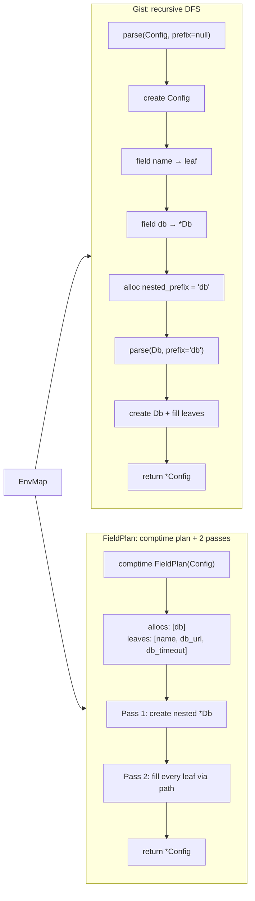
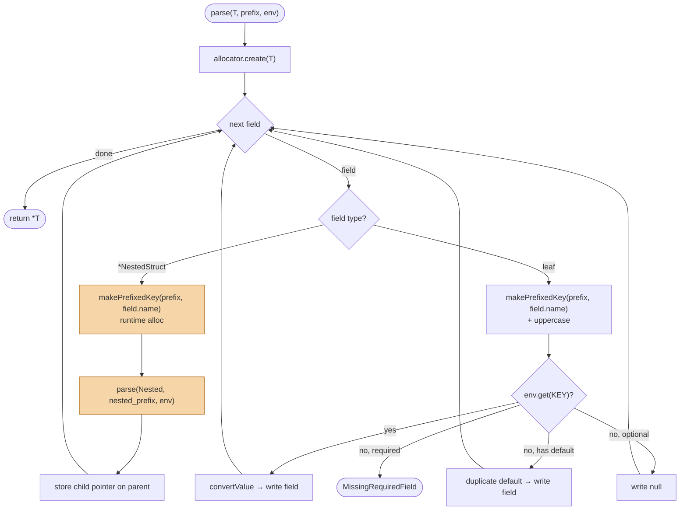
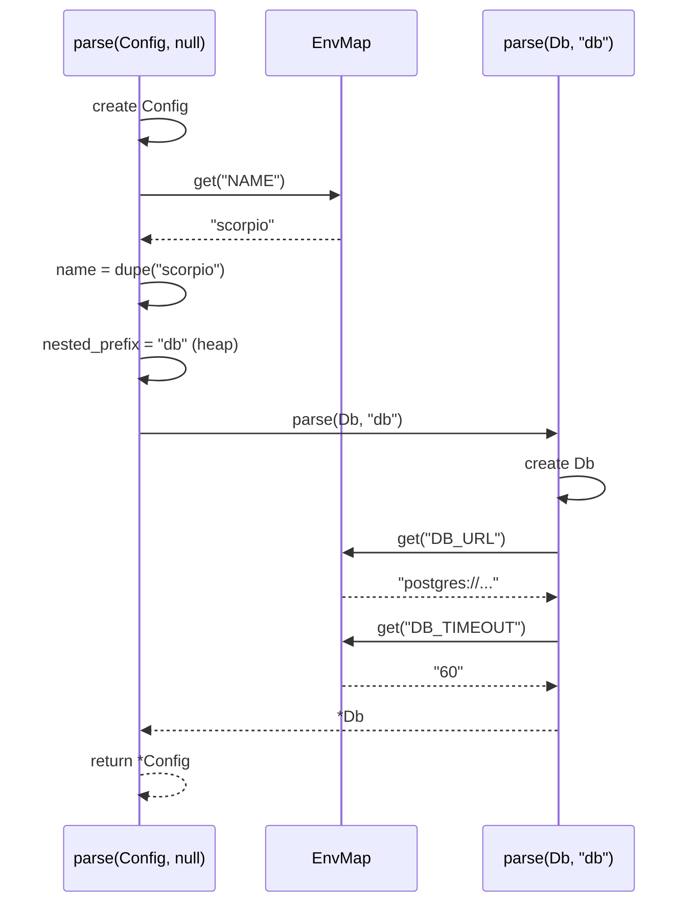
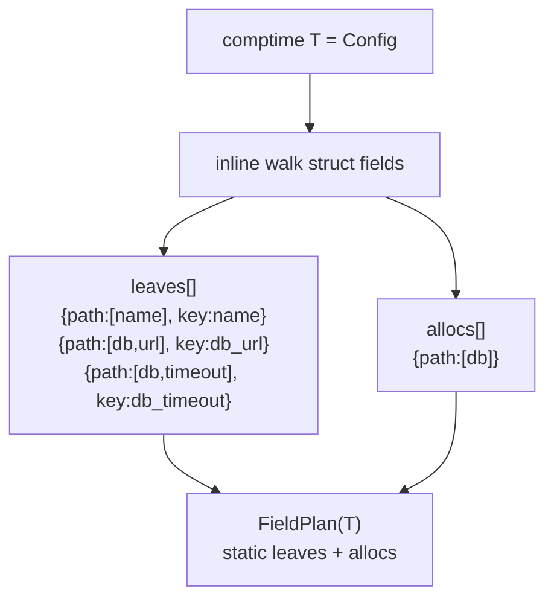
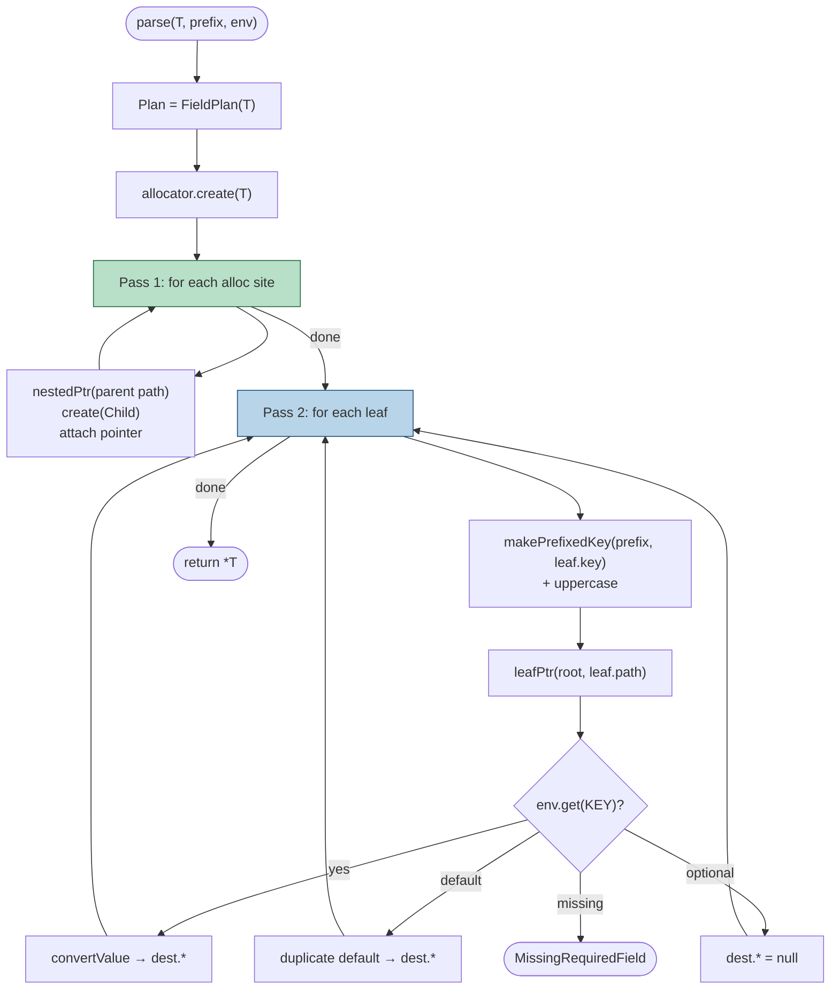
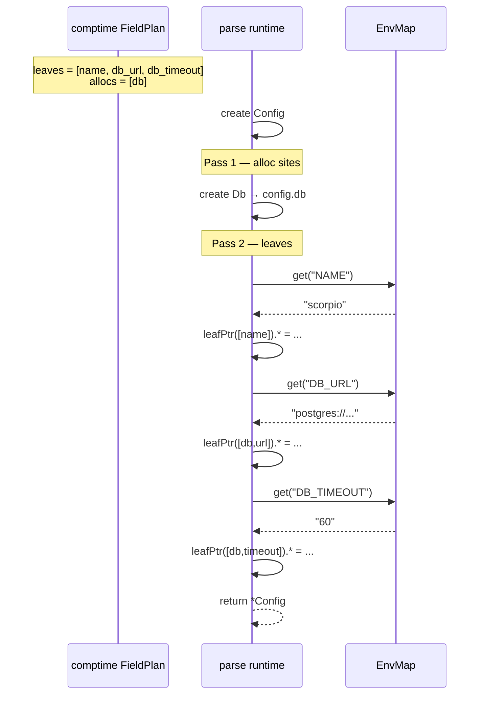
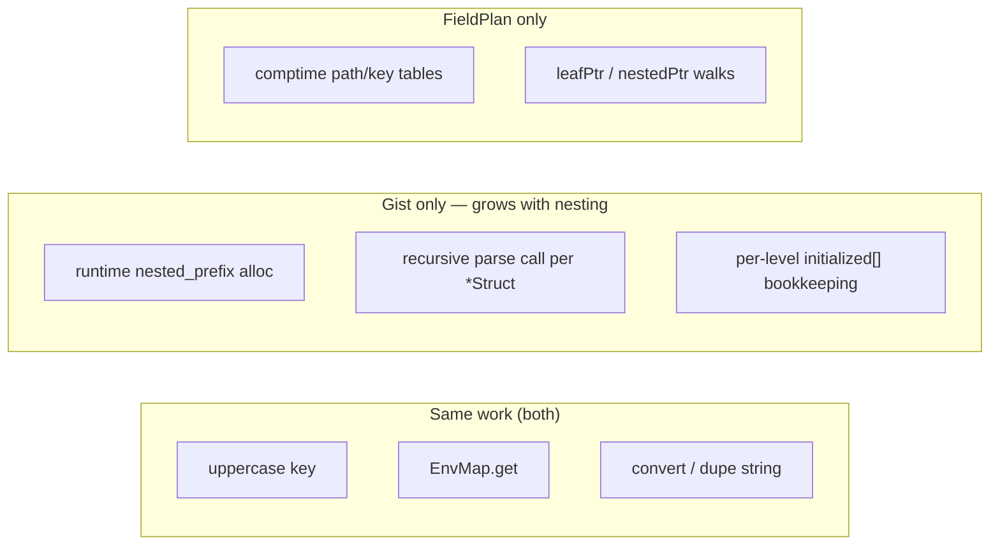

# How both parsers operate

Example config used in the diagrams:

```zig
const Db = struct { url: []const u8, timeout: i32 = 30 };
const Config = struct {
    name: []const u8,
    db: *Db,
};
// Env: NAME=scorpio, DB_URL=postgres://..., DB_TIMEOUT=60
```

---

## Side-by-side overview



---

## Gist — recursive field walk

At runtime, each struct level walks its fields. Nested `*Struct` fields recurse with a newly allocated prefix string.



### Call tree for `Config`



**Cost drivers:** one recursive call + one prefix allocation per nesting level; leaf key work repeats the same pattern at every depth.

---

## FieldPlan — comptime plan, flat runtime

### Phase A — compile time

Walk `T` once into two static tables. Keys like `db_url` are joined at comptime (no heap).



### Phase B — runtime (two passes)



### Passes for `Config`



**Cost drivers:** nested prefixes are free (comptime); nested structs are allocated in one flat pass; leaf fills walk paths with `leafPtr` (small constant overhead on flat configs).

---

## Where the time goes



| | Gist | FieldPlan |
|---|---|---|
| Struct discovery | runtime `inline for` per level | comptime `FieldPlan` tables |
| Nested `*Struct` | recurse + alloc prefix | Pass 1 create only |
| Leaf keys | `prefix_field` at each depth | comptime `db_url`, optional runtime app prefix |
| Flat configs | same leaf work | same leaf work + path indirection |
| Nested configs | extra allocs + recursion | fewer allocs → faster in bench |
