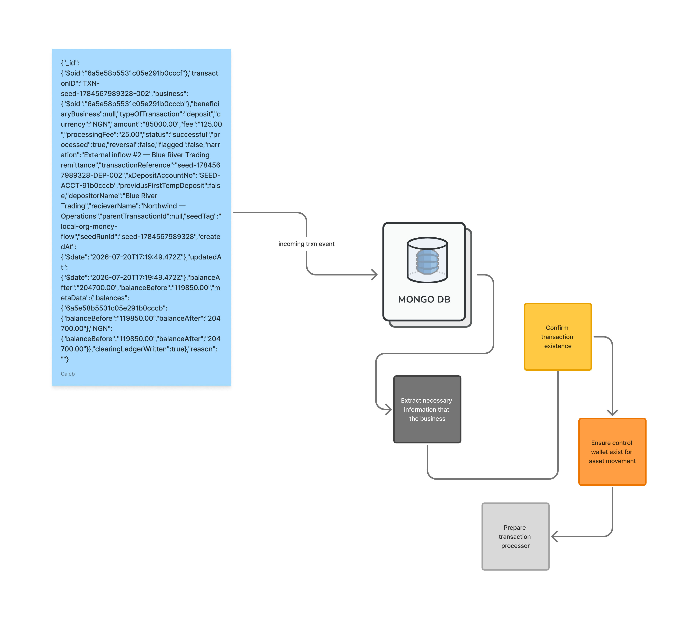

I am writing this piece staring at my recent work on the version two implementation of the ledger solution for Cudium, which I worked on with my team lead about 2-3 years back. I have been meaning to write about this for a while now, but I have been busy with other projects and personal stuff. It is not yet deployed to production — it is a work in progress, and I am sharing my thoughts and learnings with you.

## The problem

We are growing, and it is becoming increasingly difficult to monitor and track the flow of money in and out of the company. The initial solution simply logged all transactions and reported them from the database. If, for example, you wanted to know the balance of a particular account, you looked into the wallet and saw the balance. This is not scalable and not efficient. A question like "how much money did we make per currency?" becomes difficult to answer.

Funny enough, I have always loved Zig, and then I started following TigerBeetle and was blown away by the simplicity and elegance of the design. I have always wanted to build a ledger solution like that, but I never had the opportunity to. So I decided to build one for Cudium — not in Zig, and not using TigerBeetle itself, but using event-driven architecture to build a solution that is scalable and efficient, borrowing a bit from TigerBeetle's approach so that we could solve our problem while keeping costs down, since we are not yet a big company and are not moving a lot of money.

After reading a couple of articles from renowned payment companies like Stripe and Airbnb, I realized that they use event-driven architecture to build their ledger solutions to some extent. So I decided to use the same approach, but also bring in ideas from TigerBeetle's approach as a financial ledger database to solve the problem we face.

## The solution: Transaction as an event

> What happens when a transaction is created and treated as an event?

Transaction as an event is one of the most common ways of building financial solutions, because if every movement of assets from point A to point B is treated as an event, then a transaction is just an event wrapped around the movement of assets. Obviously, money is not the only asset that gets moved — other assets like inventory or services can move too.

> There are many things in this world that have value which can be exchanged, which is why I like to define a transaction, financially, as a movement of assets and liabilities.

Back to the processor: if a transaction is considered an event, what are the key things we need to keep in mind when working with such an event, to be able to call it a successful or failed transaction and still have balanced books?

## Key ingredients to consider when building a ledger solution for transactions

- **Trust**

When building a ledger solution for transactions, one needs to be able to evaluate the trustworthiness of the transaction and the integrity of the data, since we treat the data as a source of truth. Keeping this in mind while building ensures we can be rest assured of the whole system.

- **Consistency**

All transactions that enter the system must be processed with constant behaviour, meaning the transaction must be deterministic and lead to the same outcome — i.e., idempotent. Once a transaction is processed, reprocessing it has no further effect on the system.

- **Speed of execution**

No one loves a slow transaction. An average person expects their assets to be processed at a very fast speed, although this is subject to the provider's ability to live up to that promise. I personally expect any system I build to operate in milliseconds, not seconds.

- **Atomicity**

Any transaction processed must be atomic, meaning it must either fully succeed or fully fail — never partially. This ensures the transaction never leaves the system in a state that's inconsistent with the rest of it.

- **Isolation**

Transactions must be isolated from each other, meaning one transaction's processing must not be affected by another's.

- **Correctness**

At the end of the day, we need to be able to ensure the transaction is correct and the data is accurate and consistent. This is how we build a trustworthy system.



In the diagram above, we have a trigger that is responsible for detecting a transaction and sending it to the processor. The processor is responsible for processing the transaction and updating the ledger. The ledger is responsible for storing the transaction and the resulting state of the ledger. Let's go into more details about how this works.

An event comes in, typically tracked using configured matching rules on document creation or updates. This event in this case is a transaction information. Most people think of transaction as binding within an application but in this case, it is binding withing the confines of the database. 

Let's say we have a transaction event with the following information: 

```json
{
    "operation": "insert",
    "ns_collection": {
        "ns": "transactions",
    }
    "fulldocument": {
        "_id": "mock-transaction-id",
        "amount": 100,
        "currency": "USD",
        "description": "Payment for services",
        "status": "pending",
        "sender":"mock-sender-id",
        "receiver":"mock-receiver-id",
        "provider": "mock-provider-id",
        "processed": false,
        "reason": "Payment for services",
        "status": "pending",
        "createdAt": "2026-09-12T10:00:00Z",
        "updatedAt": "2026-09-12T10:00:00Z"
    }
}
```

Since this event type is `insert`, the trigger will run. From this incoming event, we will do some early data extraction and validation checks to ensure the transaction is valid and the data is accurate and consistent.

```js
exports = async function(changeEvent) {
    const operation = changeEvent.operationType.toUpperCase();
    if (!_.has(OperationType, operation)) {
        return;
    }
    const appSettings = context.environment.values;
    const clusterName = appSettings.CLUSTER_NAME;
    const databaseName = appSettings.DATABASE_NAME;
    const treasuryBusinessId = appSettings.TREASURY_BUSINESS_ID;
    if (!hasTreasuryConfigured(appSettings)) {
        throw new Error(`
            TREASURY_BUSINESS_ID is required —\n
            set a real treasury business ObjectId in App Services\n
            values/environments before deploying (empty value fail-closes all wallet processing)\n
            TREASURY_BUSINESS_ID: ${treasuryBusinessId}`
        );
    }


    const mongoClient = context.services.get(clusterName);
    const db = mongoClient.db(databaseName);
    const {
        typeOfTransaction: transactionType,
        business: originatingBusinessRaw,
        settlementBusiness: settlementBusinessRaw,
        amount: amountRaw,
        fee: feeRaw,
        processingFee: processingFeeRaw,
        processedBy: providerRaw,
        currency,
        beneficiaryBusiness: beneficiaryBusinessRaw,
        parentTransactionId: parentTransactionRaw,
        _id: transactionRaw,
    } = changeEvent.fullDocument;
    const walletOwnerId = settlementBusinessRaw
        ? toObjectId(settlementBusinessRaw)
        : toObjectId(originatingBusinessRaw);
    const transactionId = toObjectId(transactionRaw);
    const beneficiaryBusinessId = beneficiaryBusinessRaw
        ? toObjectId(beneficiaryBusinessRaw)
        : null;
    const logger = createLogger("WalletTxn", transactionId);
}

```

Idempotency checks is very important when working with transactions since we want to avoid processing the same transaction multiple times. Hence, why we need to check if the transaction has already been processed before. We can do this by figuring out if the transaction has already been processed by checking the `processed` field in the transaction document. If it is `true`, we know the transaction has already been processed and we can skip it.

```js
const transaction = appDb.collection(databaseCollections.TRANSACTION);
const [transactionExist, curTransaction] = await Promise.all([ 
    transaction.count({ _id: transactionId, processed: false }), 
    transaction.findOne({ _id: transactionId, processed: false })
]).catch(err => { throw err; });

if (!curTransaction) {
    log.warn("No unprocessed transaction found — exiting");
    return null;
}

```

Thinking about it now, the previous transaction  processor violates some basic finanical rules like, "for every credit, there must be a corresponding debit". Instead, I only created a one-leg transfer flow for debit and credit and for transfer two legs transfer flow. Looking back now, I know better.

Let's see what a transaction processor should look like, then we can tear it apart:

```js
const accounts = AccountRegistryFactory(appDb, TREASURY_BUSINESS_ID, log);
const fundCheck = FundChecker(appDb, transactionId, log);
const {executeLinked} = ExecutorFactory(appDb, {
    log,
    fundCheck
});
const processor = TransactionProcessor({
    appDb,
    client,
    log,
    accounts,
    executeLinked,
    changeEvent,
    curTransaction,
    transactionId,
    typeOfTransaction,
    businessId,
    beneficiaryBusinessId,
    parentTransactionIdStr,
    currency,
    amount,
    fee,
    processingFee,
    isReversibleTrx,
    providerIdentity
}); 
```

Given the asset (value) in this case has to move from an account to another account and vice-versa. We need to ensure that account all our account for financial calculations are in place so we can track movement from external and internal accounts in the system, that way we will know how much we are making or losing. A factory function can help us do before the actual transaction starts. One thing to ensure is that, for any resource that we will be interacting with, we need to lay down indexes such that we can't have TOCTOU issue i.e we don't have a situation where one trigger is checking while another one has updated the transaction. In this case, I hit a blocker because the mongodb trigger does not support index creation so therefore, I moved the plan to CI stage ensuring that all necessary indexes are in-place before triggers run. 

## AccountRegistryFactory

> A factory function to help ensure sanity for all needed control account for us.

AccountRegistryFactory is just that component to help ensure sanity for all needed control account for us. Here is just a simple example of how it looks, loading or creating account if it does not existing before.

```js
function AccountRegistryFactory(db, treasuryBusinessId, logger) {
    const wallets = db.collection(databaseCollections.WALLET);
    const cache = {};
    const treasuryId = toObjectId(treasuryBusinessId);

    async function ensureControlWallet(currency, role) {
        const key = `${treasuryId}:${currency}:${role}`;
        if (cache[key]) return cache[key];

        // find the treasury wallet, or insert a zero-balance one.
        // duplicate-key means another trigger won the race — re-read.
        const ref = { businessId: treasuryId, currency, role, nature: natureOf(role) };
        cache[key] = ref;
        return ref;
    }

    return {
        treasuryId,
        async control(currency) {
            // one set per currency: EXTERNAL, MAIN, TRANSACTION_FEE, PROCESSING_FEE
            const [external, main, fee, processingFee] = await Promise.all([
                ensureControlWallet(currency, WalletRole.EXTERNAL),
                ensureControlWallet(currency, WalletRole.MAIN),
                ensureControlWallet(currency, WalletRole.TRANSACTION_FEE),
                ensureControlWallet(currency, WalletRole.PROCESSING_FEE),
            ]);
            return { EXTERNAL: external, MAIN: main, TRANSACTION_FEE: fee, PROCESSING_FEE: processingFee };
        },
        customer(businessId, currency) {
            // treasury cannot be a customer party — control and liability stay distinct
            return { businessId, currency, role: WalletRole.CUSTOMER, nature: AccountNature[WalletRole.CUSTOMER] };
        },
    };
}
```

> You will notice the use of closure in this article right ? Yes, triggers do not support the import of external modules, so we need to use closure to create a private scope for the function.


## FundChecker

> A component to help ensure that the transaction has enough assets to cover the movement of assets from one account to another.

Ususally, before any transaction can proceed , we need to ensure that account involved in the transaction has enough assets to cover the movement of assets from one account to another. FundChecker is just that component to help ensure that the transaction has enough assets to cover the movement of assets from one account to another. Here is just a simple example of how it looks, checking if the account has enough assets to cover the movement of assets from one account to another.

We do this by creating a checkpoint on account  to help use calculate the sum of amount that has beeb transacted from and to the account. This way we ensure correctness for the new transaction from the ledger perspective. A typical checkpoint account balance calculating function can look like this:

```js
async function sumClearingEffects(db, account, session, { checkpointId = null, fullScan = false } = {}) {
    const ledgers = db.collection(databaseCollections.LEDGER);

    // ledger docs where this account is the debit *or* credit side
    // (same currency, business, role). If we have a checkpoint and are
    // not doing a full scan, only read entries after that _id.
    const docs = await ledgers.find(/* filter */, { projection: { transfers: 1 }, session }).toArray();

    let effects = 0;
    for (const doc of docs) {
        for (const transfer of doc.transfers || []) {
            const units = transfer.amountUnits ?? toMinorUnits(transfer.amount);
            // +credit / −debit (or the reverse) depending on account nature
            effects += transferEndpointEffect(account, transfer.debit, AccountingPostingSide.DEBIT, units);
            effects += transferEndpointEffect(account, transfer.credit, AccountingPostingSide.CREDIT, units);
        }
    }
    return effects;
}

function transferEndpointEffect(account, endpoint, side, units) {
    // skip unless this debit/credit leg is the same business, currency, and role
    if (!endpoint) return 0;

    // EXTERNAL (asset): debit +, credit −
    // liability / others: debit −, credit +
    const debitUp = debitIncreasesBalance(account.nature || natureOf(account.role));
    if (side === AccountingPostingSide.DEBIT) return debitUp ? units : -units;
    return debitUp ? -units : units;
}

function debitIncreasesBalance(nature) {
    return nature === AccountNature[WalletRole.EXTERNAL];
}

```

The sign flip is the whole point of `transferEndpointEffect`. Every transfer is two-sided — a debit and a credit — but those sides are not "minus" and "plus" on every account. EXTERNAL wallets are assets (money we hold, or that sits with a provider), so a debit increases the balance and a credit decreases it. Customer wallets and the other control accounts are liabilities: a credit increases what we owe them, a debit decreases it. Skip that nature check and summing clearing effects treats a customer payout the same as a treasury inflow, and FundChecker would pass or fail the wrong accounts.

Based on the running idea of this function above, we can now create a FundChecker function that can look like this, such that it calculated the transaction amount currently in progress and also the amount in the wallet to identify the spendable amount and if it will be sufficient to cover the transaction:

```js
function FundChecker(db, transactionId, logger) {
    const transactions = db.collection(databaseCollections.TRANSACTION);

    return async function (businessId, amount, currency, session) {
        // other unprocessed withdrawals / transfers / NGN swaps for this
        // business, excluding FAILED and this trigger's own txn.
        // SWAP reserved = amount * rate + fee; otherwise amount + fee.
        const locked = await sumReservedInFlight(transactions, /* aggregation */);

        const derived = await deriveBalance(db, {
            businessId,
            currency,
            role: WalletRole.CUSTOMER,
            nature: AccountNature[WalletRole.CUSTOMER],
        }, session);

        const spendable = derived.derivedBalance - toMinorUnits(locked);
        const required = toMinorUnits(amount);
        return {
            hasSufficientFund: spendable >= required,
            availableBalance: fromMinorUnits(derived.derivedBalance),
            derived,
        };
    };
}
```

Accounts and fund checks get us to the door. The write itself is a different problem: posting linked debit and credit legs without leaving the books half-done. That is `ExecutorFactory` and `TransactionProcessor`, and it is enough for its own post.

Next: [the executor and the transaction processor](/posts/blog/cudium/implementing-an-executor-for-transaction).

