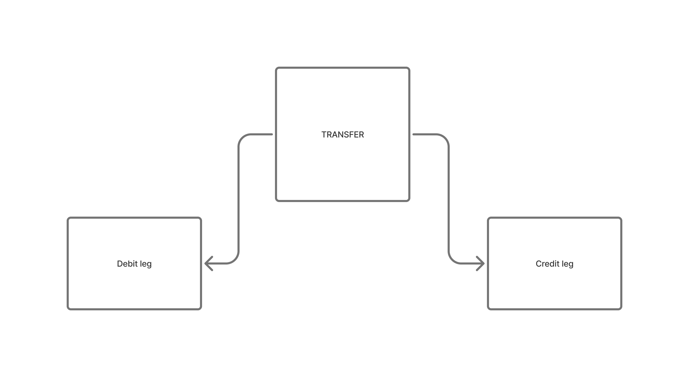

> Part 2. Previous: [transaction as an event](/posts/blog/cudium/building-a-new-ledger-solution).

I'm continuing from the [first part](/posts/blog/cudium/building-a-new-ledger-solution), where a transaction arrives as a database event, control accounts are ensured, and `FundChecker` decides whether the customer wallet can cover the movement.

Accounts and the fund check get us to the door. This part is about the write itself: `ExecutorFactory` posts linked ledger transfers in one go, and `TransactionProcessor` decides which legs to post for a deposit, withdrawal, transfer, or swap.

## ExecutorFactory

`ExecutorFactory` is a singleton execution engine that bundles together everything a transaction needs at write time: balance reconciliation for the accounts involved, transaction assertion, settlement checks, and the actual posting of transaction legs.

Let's start with how we derive an account's balance. Rather than replaying the entire ledger on every read, we use an effective running-sum calculation anchored to a checkpoint id — essentially a snapshot of the account balance at a point in time — so each lookup only has to account for what's changed since that checkpoint.

```js
async function deriveBalance(db, account, session) {
    const wallet = await db.collection(databaseCollections.WALLET)
        .findOne(walletFilterForRef(account), { session });
    // missing wallet is a hard fail — the registry should have created it

    // effects after the last checkpoint (snapshot), not a full ledger scan
    const effects = await sumClearingEffects(db, account, session, {
        checkpointId: wallet.effectsCheckpointId,
    });

    // frozen opening if we have one; otherwise back-solve from availableBalance
    const opening = isDefined(wallet.ledgerOpeningBalance)
        ? Number(wallet.ledgerOpeningBalance)
        : toMinorUnits(wallet.availableBalance) - effects;

    return { wallet, openingBalance: opening, effectsBalance: effects, derivedBalance: opening + effects };
}
```

With a way to derive a balance, the next piece is applying a posting to it. `applySide` takes an account, a posting side (debit or credit), and an amount, and returns the account's balance before and after — while enforcing the rules that keep a customer wallet honest along the way.

```js
function WalletPorterFactory(db, { logger, fundCheck }) {
    async function applySide(account, side, amount, { session, running }) {
        const key = walletKey(account);
        const units = toMinorUnits(amount);
        const nature = account.nature || natureOf(account.role);

        // first touch: seed this account's running balance from deriveBalance
        if (!running[key]) {
            const derived = await deriveBalance(db, account, session);
            running[key] = { account, balanceUnits: derived.derivedBalance };
        }

        // customer debit: FundChecker must pass, and the wallet cannot go negative
        if (isCustomer(account.role) && side === AccountingPostingSide.DEBIT && fundCheck) {
            const { hasSufficientFund } = await fundCheck(account.businessId, amount, account.currency, session);
            if (!hasSufficientFund) throw new Error("insufficient funds");
        }

        // same sign rule as transferEndpointEffect: asset debit-up, liability debit-down
        const debitUp = debitIncreasesBalance(nature);
        const delta = side === AccountingPostingSide.DEBIT
            ? (debitUp ? units : -units)
            : (debitUp ? -units : units);

        const before = running[key].balanceUnits;
        const after = before + delta;
        if (isCustomer(account.role) && after < 0) throw new Error("insufficient funds");
        running[key].balanceUnits = after;

        return { balanceBefore: fromMinorUnits(before), balanceAfter: fromMinorUnits(after), ...account };
    }

    return { applySide };
}
```

A running balance derived on the fly is only useful if it's also trustworthy. That's what the reconciler is for: it recomputes an account's balance straight from the stored ledger entries and compares it against the projection, so we can catch drift instead of trusting it blindly. When drift shows up, `healBalance` replays the ledger snapshot back onto the wallet projection and folds the checkpoint forward, so the same entry never has to be rescanned again.

```js
function AuditingReconciler(db, logger) {
    const wallets = db.collection(databaseCollections.WALLET);

    async function syncBalance(account, { session, expectedProjection, expectedCheckpointId, newBalance, ledgerOpeningBalance, effectsCheckpointId, foldCheckpoint = false }) {
        // optimistic write: match on current projection/checkpoint so two
        // triggers cannot clobber each other. matchedCount === 0 is a conflict.
        const filter = {
            ...walletFilterForRef(account),
            ...(expectedProjection != null ? { availableBalance: expectedProjection } : {}),
            ...(expectedCheckpointId !== undefined ? { effectsCheckpointId: expectedCheckpointId } : {}),
        };
        const { matchedCount } = await wallets.updateOne(filter, {
            $set: {
                availableBalance: newBalance,
                ledgerOpeningBalance,
                balanceSource: "ledger-derived",
                ...(foldCheckpoint ? { effectsCheckpointId } : {}),
            },
        }, { session, upsert: false });
        if (matchedCount === 0) throw new Error("projection sync conflict");
    }

    async function healBalance(ledgerDoc, session) {
        // replay each wallet snapshot from the ledger onto the projection,
        // then fold the checkpoint forward so we do not rescan this entry.
        for (const snap of Object.values(ledgerDoc.balancesByWallet || {})) {
            const account = { businessId: snap.businessId, currency: snap.currency, role: snap.role };
            const wallet = await wallets.findOne(walletFilterForRef(account), { session });
            if (!wallet) continue;
            await syncBalance(account, {
                session,
                newBalance: snap.balanceAfter,
                ledgerOpeningBalance: toMinorUnits(snap.balanceAfter),
                effectsCheckpointId: maxLedgerId(wallet.effectsCheckpointId, ledgerDoc._id),
                foldCheckpoint: true,
            }).catch((err) => logger?.warn("projection heal skipped", err.message));
        }
    }

    return { syncBalance, healBalance };
}
```

Since every posting follows double-entry rules, it helps to have a concrete way to represent how a transaction moves money — a chain of debit/credit legs that must net to zero. This idea borrows from TigerBeetle's approach of modeling a transfer as a chain of linked debit and credit legs.



As the diagram shows, moving money between accounts usually takes more than one leg. So we represent a transaction as an array of these legs — a chain.

```js
function transfer(debit, credit, amount, currency, code, label) {
    const amountUnits = toMinorUnits(amount);
    if (!(amountUnits > 0)) throw new Error("non-positive transfer");
    // one debit account, one credit account, same amount — a single chain link
    return { debit, credit, amountUnits, currency, code, label };
}
```

We can also flip a chain to represent its reversal:

```js
function invertChain(transfers, reversalCode) {
    // walk the chain backwards; swap debit and credit on each link
    return transfers.slice().reverse().map((t) => ({
        debit: t.credit,
        credit: t.debit,
        amountUnits: t.amountUnits ?? toMinorUnits(t.amount),
        currency: t.currency,
        code: reversalCode,
        label: t.label ? `rev_${t.label}` : "reversal",
    }));
}
```

`invertChain` gives us a clean way to plan the series of chain links that need to be posted for a given transaction type. Let's walk through chain planning using a deposit as the example.

For a deposit, money comes in externally and needs to land in the customer's wallet, net of any fees. The chain moves funds from `EXTERNAL` into `MAIN` (the gross amount), then from `MAIN` into the customer account (the net amount), with optional legs peeling off a transaction fee and a processing fee into their own control accounts.

```js
async function planDeposit({ accounts, businessId, currency, amount, fee, processingFee }) {
    const control = await accounts.control(currency);
    const customer = accounts.customer(businessId, currency);
    const net = toMinorUnits(amount) - toMinorUnits(fee) - toMinorUnits(processingFee);
    if (net <= 0) throw new Error("deposit net must be positive");

    // EXTERNAL → MAIN (gross in), MAIN → customer (net)
    // optional: MAIN → TRANSACTION_FEE / PROCESSING_FEE
    const chain = [
        transfer(control.EXTERNAL, control.MAIN, amount, currency, TransferCode.DEPOSIT, AccountingChainLabels.SETTLEMENT_IN),
        transfer(control.MAIN, customer, fromMinorUnits(net), currency, TransferCode.DEPOSIT, AccountingChainLabels.PRINCIPAL),
    ];
    if (fee > 0) chain.push(transfer(control.MAIN, control.TRANSACTION_FEE, fee, currency, TransferCode.DEPOSIT, AccountingChainLabels.TRANSACTION_FEE));
    if (processingFee > 0) chain.push(transfer(control.MAIN, control.PROCESSING_FEE, processingFee, currency, TransferCode.DEPOSIT, AccountingChainLabels.PROCESSING_FEE));
    return chain;
}

async function planReverseDeposit(args) {
    return invertChain(await planDeposit(args), TransferCode.REV_DEPOSIT);
}
```

The same pattern — plan a chain of legs, reuse `invertChain` for the reversal — carries over to the other transaction types. Here's what the resulting chain looks like once it's built, for a currency swap:

```json
{
  "transfers": [
    {
      "debit": {
        "businessId": "6a21a71a4740573de2833cfb",
        "currency": "NGN",
        "role": "customer_account"
      },
      "credit": {
        "businessId": "6a21a10f4740573de2833cb3",
        "currency": "NGN",
        "role": "main_account"
      },
      "amount": 100005.4,
      "amountUnits": 10000540,
      "currency": "NGN",
      "code": 103,
      "label": "sell_src"
    },
    {
      "debit": {
        "businessId": "6a21a10f4740573de2833cb3",
        "currency": "USD",
        "role": "main_account"
      },
      "credit": {
        "businessId": "6a21a71a4740573de2833cfb",
        "currency": "USD",
        "role": "customer_account"
      },
      "amount": 72.05,
      "amountUnits": 7205,
      "currency": "USD",
      "code": 103,
      "label": "buy_dst"
    }
  ]
}
```

Once a chain is planned, we run it through a settlement handler that nets out the effect on each `MAIN` wallet touched by the chain — debit side up, credit side down — so we can confirm the control accounts stay balanced before anything is committed.

```js
function handleSettlementLegs(chain) {
    const nets = {};
    for (const t of chain) {
        const units = legAmountUnits(t);
        // only MAIN wallets — EXTERNAL, customer, and fee legs are skipped
        for (const [account, side] of [[t.debit, AccountingPostingSide.DEBIT], [t.credit, AccountingPostingSide.CREDIT]]) {
            if (account.role !== WalletRole.MAIN) continue;
            // same sign rule as applySide: asset debit-up, liability debit-down
            const debitUp = debitIncreasesBalance(account.nature || natureOf(account.role));
            const delta = side === AccountingPostingSide.DEBIT
                ? (debitUp ? units : -units)
                : (debitUp ? -units : units);
            const key = walletKey(account);
            nets[key] = (nets[key] || 0) + delta;
        }
    }
    return nets;
}
```

## Putting it together: `executeLinked`

Everything above — balance derivation, `applySide`, chain planning, and settlement netting — comes together in `executeLinked`, the function that actually commits a chain to the ledger.

```js
async function executeLinked({ chain, session, transaction, transactionType, transactionId }) {
    assertInTransaction(session, "linked clearing chain");
    const { balanced } = assertionHelpers.assertBalancedChain(chain);

    const running = {};
    const balancesByWallet = {};
    const ctx = { session, transactionId, running };

    // apply debit then credit on every leg; later legs see earlier running balances
    for (const t of chain) {
        const amount = fromMinorUnits(legAmountUnits(t));
        balancesByWallet[walletKey(t.debit)] = await walletPorter.applySide(t.debit, AccountingPostingSide.DEBIT, amount, ctx);
        balancesByWallet[walletKey(t.credit)] = await walletPorter.applySide(t.credit, AccountingPostingSide.CREDIT, amount, ctx);
    }
    assertionHelpers.assertPostingConsistency(chain, balancesByWallet);
    // settlement chains: MAIN nets must be ~0 (handleSettlementLegs)

    // one immutable ledger doc: transfers, balances, prevHash → entryHash
    const doc = { schemaVersion: "clearing-v2", transactionId: transaction._id, transactionType, transfers: chain, balancesByWallet, balanced };
    const tip = await loadChainTip(ledgerDb, session);
    doc.prevHash = tip.prevHash;
    doc.seq = tip.seq;
    doc.entryHash = await hashLedgerEntry(doc);
    const { insertedId } = await ledgerDb.insertOne(doc, { session });

    // fold each wallet projection forward; expectedProjection is the optimistic lock
    for (const state of Object.values(running)) {
        await auditingReconciler.syncBalance(state.ref, {
            session,
            expectedProjection: state.projectionBefore,
            expectedCheckpointId: state.effectsCheckpointId,
            newBalance: fromMinorUnits(state.balanceUnits),
            foldCheckpoint: true,
            effectsCheckpointId: insertedId,
        });
    }

    return { balancesByWallet, balanced, chain, ledgerId: insertedId };
}
```

At a high level, it does five things, in order, inside a single database session:

1. **Validates the chain.** `assertBalancedChain` checks that debits and credits net to zero per currency before any posting happens, and every step logs the legs it's about to write.
2. **Applies every leg.** For each transfer in the chain, it calls `applySide` for the debit and credit account in turn, keeping a running in-memory balance per wallet (`running`) so later legs in the same chain see the effect of earlier ones. It then checks the result with `assertPostingConsistency` and, for chains with a settlement leg, re-nets the `MAIN` wallet effects and rejects the chain if any control account doesn't net back to zero within tolerance.
3. **Writes an immutable ledger entry.** It builds a single document capturing every transfer, the resulting balances, and which wallets were debited/credited, then chains it to the previous entry with `prevHash`/`entryHash` — giving the ledger the same tamper-evident, append-only shape as a hash chain — before inserting it.
4. **Folds the projection forward.** For each wallet touched, it calls `auditingReconciler.syncBalance` with the *previous* known projection and checkpoint as an optimistic-concurrency guard, so two triggers can't silently overwrite each other's work. This is what keeps the fast-path wallet balance in sync with the ledger of record.
5. **Returns the result.** The caller gets back the per-wallet balances, whether the chain balanced, the chain itself, and the new ledger entry's id — everything `TransactionProcessor` needs to build its response.

In short, `executeLinked` is the single choke point where a planned chain becomes a durable, balanced, hash-linked fact in the ledger — and every transaction type, no matter how many legs it plans, ends up going through it.

Next up: how `TransactionProcessor` decides which chain to plan for a deposit, withdrawal, transfer, or swap, and routes each one through `executeLinked`. Continue to [Part 3: Transaction Processor](/posts/blog/cudium/building-a-new-ledger-solution-transaction-processor).