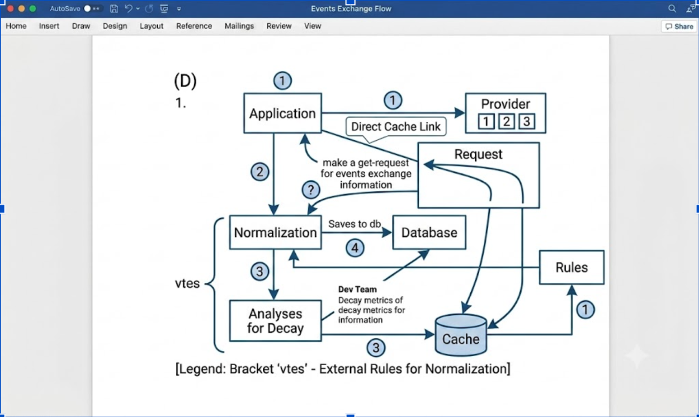
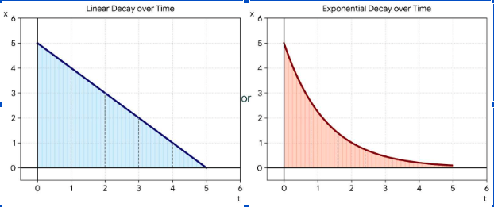

# Currency Rate Flow 

Once in a while running an operation in a payment platform, you might decide once in a while every day when to switch rates between offers provided by your supported provider. This is majorly because if you want to provide value to your customer while ensuring that you don't incur losses.
Similarly to how trading companies offer you a series of prices or even sellers with their proposed prices, you are caught in between making a good decision or a very bad one. Well, how can I as a developer help you make a better decision? I thought to myself.

Apparently, the answer lies in the fact that your sellers will always update their prices at intervals and your human brain cannot keep track of the prices and their decay rate (i.e. the time it takes for such prices to be old and irrelevant to you.) Therefore, there has to be a way for a system to track it and proffer suggestions during the decision making process to help get a good foreign exchange rate.


## Collecting data from Brokers

Usually, providers typically provide a simple endpoint that helps applications know the current rate they operate with. This allows us to come up with a solution to track prices, decay rate, and historical data to make it better.

## A Solution?

Tradeoffs exist a lot in software engineering, they help make solutions clear on what to handle and what to ignore. Hence, in this particular case we will prioritize:

- Storing rate entry temporarily
- Track decay rate and also give scores to rate-offered
- Allow stakeholder determine the final rate to use active by algorithm or manually

We will start by mapping out an expectation for the data we will receive from the provider. Typically, this helps us start from the source of truth which in this case is not the database.

Example from provider A: 
```json
{
  "data": [
    {
      "currency": "USD",
      "exchangeRate": 0
    }
  ]
}
```

Example from provider B: 
```json
{
  "success": true,
  "message": "Ok",
  "data": {
    "rate": {
      "fromAmount": 790,
      "toAmount": 1,
      "_id": "64aff446139e0ad1d540232d",
      "fromCurrency": "NGN",
      "toCurrency": "USD"
    }
  }
}
```

Given that data above, there is a likelihood providers carry different shapes, therefore we have to normalize them into a single shape that we can deal with.

```js
function normalizeQuote(quote, { feePercent, fixedFee, feeBasisAmount } = {}) {
  const fromAmount = Number(quote.fromAmount);
  const toAmount = Number(quote.toAmount);
  if (!fromAmount || (toAmount !== 0 && !toAmount)) return null;

  // Fees can be passed in, or taken from per-provider config.
  const configured = (sails.config.custom.rateSelection.fees || {})[quote.provider] || {};
  const percent = feePercent ?? configured.feePercent ?? 0;
  const flat = fixedFee ?? configured.fixedFee ?? 0;
  const notional = feeBasisAmount || fromAmount;

  const rate = toAmount / fromAmount; // toCurrency per 1 fromCurrency
  const afterFees = (notional * (1 - percent) - flat) / notional;

  return {
    provider: quote.provider,
    fromCurrency: quote.fromCurrency,
    toCurrency: quote.toCurrency,
    fromAmount,
    toAmount,
    rate,
    effectiveRate: rate * Math.max(afterFees, 0),
  };
}
```
The shape and attribute of the data help us analyze how best a stakeholder can make a good decision on the best currency rate to sell.


## Architectural Flow



After we retrieve the exchange information from all provider we go through series of steps to prepare our data for analysis by dynamically making request to all supported provider and creating quite data record in our database over time for a configurable amount of time while still recording the latency, failure rate and caching based on our ranking algorithm.

```js
const providers = sails.config.custom.rateSelection.quoteProviders || [];

// Ask every registered provider at the same time, then normalize to one shape.
const fetched = await Promise.all(
  providers.map((entry) => fetchOneProvider(entry, fromCurrency, toCurrency, persist)),
);

const quotes = [];
for (const quote of fetched) {
  if (!quote) continue;

  const normalized = sails.helpers.thirdParty.rates.normalizeQuote.with({
    quote, feePercent, fixedFee, feeBasisAmount,
  });
  if (!normalized) continue;

  quotes.push(normalized);

  // Historical rows: ranking later scores these as they age (decay).
  if (persist) {
    await ProviderQuote.create({
      provider: normalized.provider,
      fromCurrency: normalized.fromCurrency,
      toCurrency: normalized.toCurrency,
      normalizedRate: normalized.rate,
      latencyMs: normalized.latencyMs,
      successRate: normalized.successRate,
      rawPayload: quote,
    });
  }
}

return quotes;

async function fetchOneProvider({ id, helper }, fromCurrency, toCurrency, persist) {
  const started = Date.now();
  const result = await helper.with({ fromCurrency, toCurrency, provider: id }).catch((err) => {
    sails.log.error(`provider-rate-fetch-failed: ${id}`, err.message);
    return null;
  });
  const latencyMs = Date.now() - started;
  const ok = result && result.success && result.data;

  // Rolling latency + failure rate — the ranking cache reads this, not the raw quote.
  await recordProviderStats(id, ok, latencyMs, persist);
  if (!ok) return null;

  const stat = await ProviderRateStat.findOne({ provider: id }).catch(() => null);
  return { ...result.data, provider: id, latencyMs, successRate: stat ? stat.successRate : 1 };
}

async function recordProviderStats(provider, ok, latencyMs, persist) {
  if (!persist) return;

  const existing = await ProviderRateStat.findOne({ provider }).catch(() => null);
  const successCount = (existing?.successCount || 0) + (ok ? 1 : 0);
  const failureCount = (existing?.failureCount || 0) + (ok ? 0 : 1);

  const values = {
    provider,
    successCount,
    failureCount,
    successRate: successCount / (successCount + failureCount),
    latencyMs: ok ? latencyMs : (existing?.latencyMs || 0),
  };

  if (existing) await ProviderRateStat.update({ id: existing.id }).set(values);
  else await ProviderRateStat.create(values);
}
```
All this can be done with a worker running in the background of our application using a cron configuration.

```js
module.exports = {
  name: 'provider-rate-poll',
  // Cron from config — this is what keeps quotes fresh without a human watching.
  getRepeat: () => ({ pattern: sails.config.custom.rateSelection.cronPattern }),
  options: {
    concurrency: 1,
    removeOnComplete: { count: 20 },
    removeOnFail: { count: 50 },
  },
  workerFunction: async ({ job, namespace, logger }) => {
    const rateSelection = sails.config.custom.rateSelection;
    const log = logger.child({
      jobId: job.id,
      jobName: job.name,
      attempt: job.attemptsMade + 1,
    });

    log.info('job.start', { namespace, pairs: rateSelection.pairs });

    const catalog = sails.helpers.thirdParty.rates.algorithmCatalog();

    for (const pair of pairs || []) {
      const quotes = await sails.helpers.thirdParty.rates.fetchAllQuotes.with({
        fromCurrency: pair.from,
        toCurrency: pair.to,
      });

      await cache(`provider-rate:quotes:${pair.from}:${pair.to}`, quotes, cacheTtlMs);

      // Rank with each algorithm and cache those lists for the UI / stakeholder pick.
      for (const algorithm of catalog.algorithms) {
        const ranked = sails.helpers.thirdParty.rates.rankQuotes.with({
          quotes,
          algorithm: algorithm.id,
        });
        await cache(
          `provider-rate:rank:${pair.from}:${pair.to}:${algorithm.id}`,
          ranked,
          cacheTtlMs,
        );
      }
    }

    // Configurable window: drop quotes that have decayed past quoteTtlMs.
    await ProviderQuote.destroy({ createdAt: { '<': Date.now() - quoteTtlMs } });
  },
};

function cache(key, value, expiresIn) {
  return sails.helpers.createCacheableContent.with({ key, value, expiresIn });
}
```

You will notice now that we looked at all available algorithms that help predict better rates then we pick algorithms. Although we should be normalized quite before caching our result so the active quote can also be retrieved as the latest in a given [unclear] from the user. Once this is done, we rank quotes based on our algorithm and cache them before clearing out older data.

## Ranking Algorithms

Starting with the simplest version of the rank algorithm that can help with choosing the best rate, we would pick the greedy one first and discuss the others later.

### 1. Greedy approach
Greedy approach involves allowing the stakeholder to select the best price that allows them to make a lot of money depending on the currency in question. It answers the question how much more X currency can I make from converting Y currency for the buyer? Yes, greedy but well sellers don't have either. This is just the real world and not imagining.

Assume we have a list of prices delivered by several providers over time as given by several providers.

```
provider   x   y   z   a   b   c   d
price     14  20  15  17  18  19  28
```

To now select the best price to configure our rate with losing and also gaining customers can be based on many factors but in a greedy approach we will take the highest price as a sale while as a buyer we will be trying to buy at a lower price.



This graph shows how staleness can affect [unclear] removing staleness can help derive a better recommendation for fix rate.

```
Linear (per quote):      decay = max(0,   1 − age / maxAge)
Exponential (per quote): decay = max(0.5, age / maxAge)
```

Based on our output result after this, we then decide to rank [crossed-out text] based on the algorithm by weighted score or rate as shown below.

```js
function rankQuotes(quotes, algorithm, now = Date.now()) {
  const { maxAgeMs, algorithms } = sails.config.custom.rateSelection;
  const { GREEDY_MAX_RATE, WEIGHTED_SCORE } = algorithms;

  // Drop quotes past maxAge, then apply the decay from the formulas above.
  const fresh = [];
  for (const quote of quotes || []) {
    const ageMs = now - quote.createdAt;
    if (ageMs > maxAgeMs) continue;
    fresh.push(applyDecay(quote, ageMs));
  }

  const ranked = algorithm === WEIGHTED_SCORE
    ? rankByWeightedScore(fresh)
    : rankByRate(fresh, algorithm === GREEDY_MAX_RATE ? 'adjustedRate' : 'adjustedEffectiveRate');

  return { ranked, best: ranked[0] };
}

function applyDecay(quote, ageMs) {
  const { decayMode, halfLifeMs, maxAgeMs } = sails.config.custom.rateSelection;
  let decay = 1;
  if (decayMode === 'linear') decay = Math.max(0, 1 - ageMs / maxAgeMs);
  if (decayMode === 'exponential') decay = Math.pow(0.5, ageMs / halfLifeMs);

  return {
    ...quote,
    decayFactor: decay,
    adjustedRate: quote.rate * decay,
    adjustedEffectiveRate: quote.effectiveRate * decay,
  };
}

function rankByRate(quotes, field) {
  // Greedy: highest remaining rate first (seller). Flip the sort to buy cheap.
  return quotes.slice().sort((a, b) => b[field] - a[field]);
}

function rankByWeightedScore(quotes, { rateWeight, latencyWeight, successRateWeight }) {
  const rates = quotes.map((q) => q.adjustedEffectiveRate);
  const latencies = quotes.map((q) => q.latencyMs);
  const minRate = Math.min(...rates);
  const maxRate = Math.max(...rates);
  const minLatency = Math.min(...latencies);
  const maxLatency = Math.max(...latencies);

  const norm = (value, min, max) => (max === min ? 1 : (value - min) / (max - min));

  return quotes
    .map((quote) => ({
      ...quote,
      // High rate, low latency, high success — each 0–1, then weighted.
      score:
        rateWeight * norm(quote.adjustedEffectiveRate, minRate, maxRate) +
        latencyWeight * (1 - norm(quote.latencyMs, minLatency, maxLatency)) +
        successRateWeight * quote.successRate,
    }))
    .sort((a, b) => b.score - a.score);
}
```

