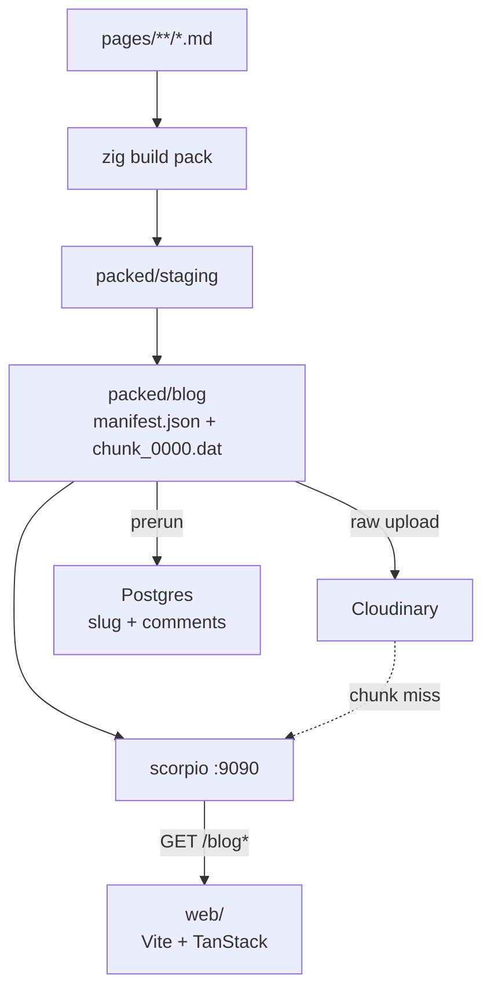

You are reading this on Scorpio. That is the point of the series.

The old guide in this slot was a neat architecture dump. Accurate enough at a distance, a bit wrong up close, and written like a README. I want the version I would actually send a friend: what I built, why the markdown never gets read from `pages/` at request time, and where the code still surprises me.

The short version. I write posts as `.md` files. `zig build pack` concatenates them into ~4 MiB chunk files and writes a `manifest.json`. A Zig process (Zap) loads that manifest, slices a document out of a chunk, and returns JSON. Postgres only knows slugs and comments. The React app in `web/` is just a reader.

If you already read [why a manifest file can be a secret power](/posts/blog/projects/why-a-manifest-file), this is that idea with the rest of the machine around it.

## Why not just read the markdown

I could have pointed the server at `pages/` and opened files on every `GET`. That works until you have a lot of posts, or you want the bodies on a CDN, or you do not want the API host to carry a git checkout.

A packed blog is closer to how I think about disk. One index. A handful of fat files. A seek, a read, done. Listing the index does not open twenty markdown files. Fetching `/blog/guides/intro` is `chunk`, `offset`, `length`.

Same instinct as Hercules, smaller stakes. Hercules splits other people's files. Scorpio splits mine.

## The shape of the thing

Three rules I keep repeating to myself:

1. Request time does not walk `pages/`.
2. The manifest is the catalogue. The chunks are the shelves.
3. Comments are a different store. Bodies never go in Postgres.

## This series

I split the walkthrough so each post can sit on one idea.

1. [Packing markdown](/posts/blog/guides/scorpio/packing-markdown) — media rewrite, staging, then the packer
2. [The manifest and the chunks](/posts/blog/guides/scorpio/manifest-and-chunks) — 4 MiB `.dat` files, slugs, incremental reuse
3. [The Zig API](/posts/blog/guides/scorpio/the-zig-api) — Zap, the splat router, `BlogCache`, Cloudinary as fallback
4. [Comments and Postgres](/posts/blog/guides/scorpio/comments-and-postgres) — prerun, `blogs` rows, comment trees
5. [The React UI](/posts/blog/guides/scorpio/the-frontend) — cards, post view, mermaid, the floating console

Read them in order if you can. Skip to the API or the UI if you already know why I pack.

## A thing I should say early

The README and the old guide disagree with the code in a few places. Chunk files are `chunk_0000.dat`, not `chunk_NNNN.bin`. Cloudinary failures during *media* upload abort the pack; failures during *chunk* upload only warn. The default `BLOG_INPUT_DIR` in `config.zig` is `pages/blog`, while `.env.sample` says `pages`. I will point at the code, not the comments I wrote when I was tired.

Anyway. That is the map.

Next: [packing markdown](/posts/blog/guides/scorpio/packing-markdown).
