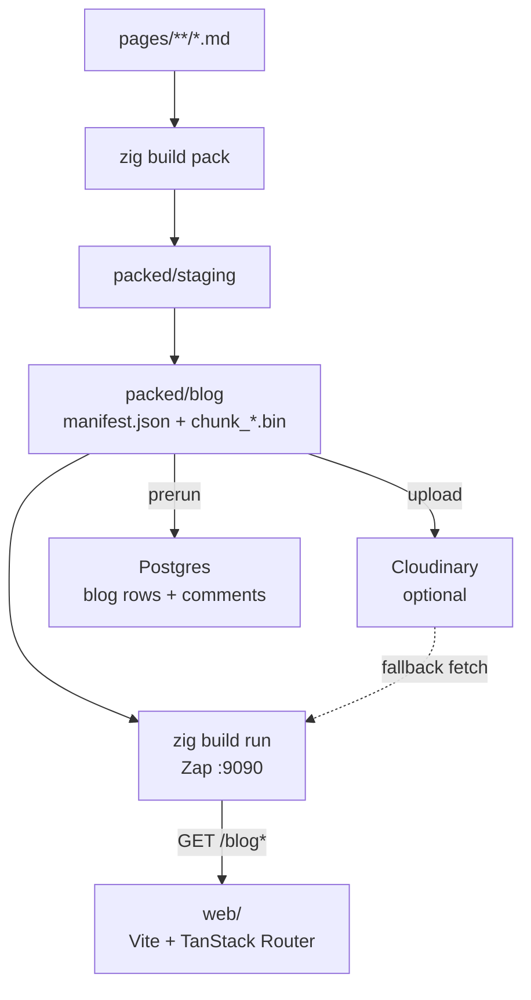

# How Scorpio works: architecture and the pack pipeline

Scorpio is a markdown-first blog stack: you author plain `.md` files, pack them into content-addressed chunks, and serve them from a Zig HTTP API. A React SPA in `web/` reads that API and renders posts.

## Big picture



At runtime the server does **not** read `pages/` directly. It loads the packed manifest and slices document bytes out of chunk files (local first, Cloudinary as fallback).

## Content pipeline

### Authoring

Markdown lives under `BLOG_INPUT_DIR` (see `.env`). With `BLOG_INPUT_DIR=pages` that includes:

- `pages/blog/**` — posts (nested folders become nested slugs, e.g. `blog/guides/intro`)
- `pages/profile.md` — profile page (`profile`)

Optional YAML frontmatter drives the UI: `title`, `summary`, `authors`, `date`, `topics`, `highlight`.

### Pack (`zig build pack`)

1. **Media** — walk markdown, upload local images/videos when configured, rewrite links into `packed/staging/`.
2. **Pack** — `libraries/processor/documents` packs staging into `packed/blog/`:
   - `manifest.json` — document index (`slug`, `path`, `chunk`, `offset`, `length`, hashes)
   - `chunk_NNNN.bin` — concatenated document payloads
3. **Upload** — changed chunks + manifest go to Cloudinary when credentials are valid (local artifacts are always written).

### Prerun (`zig build prerun`)

Upserts `blogs(slug, path)` from the manifest into Postgres so comment routes have a stable blog identity. `zig build run` depends on prerun.

## Runtime architecture

| Layer | Role |
|-------|------|
| **Zap** (`src/main.zig`) | HTTP listener (default port **9090**) |
| **Router** (`libraries/router`) | Path matching, including `*slug` splats for nested posts |
| **Actions** (`src/app/actions/blog.zig`) | List / get / comments / replies |
| **Manifest + cache** | Boot-loads `packed/blog/manifest.json`; `BlogCache` serves slices and prefetches neighbors |
| **CDN helper** | Prefer local chunk files; fall back to Cloudinary raw delivery |
| **Postgres** | Comments and replies only — markdown bodies stay in the pack |

### Main API shapes

- `GET /blog` → `{ documents: [{ slug, path, modified_at, length }] }`
- `GET /blog/*slug` → `{ slug, path, content, … }`
- Comment CRUD under `/blog/:slug/comments…`

## Frontend (`web/`)

Vite + React + TanStack Router + Tailwind. In development, `/blog` is proxied to the Zig API so the SPA can call relative URLs.

- Index / related cards from the list API
- Post view renders markdown (GFM + raw HTML for embeds)
- Folder sidebar mirrors packed `path`s
- Floating console: `ls`, `open`, `theme set paper`, etc.

```
cd web && npm run dev   # http://localhost:5173
```

## Libraries worth knowing

- `libraries/processor/documents` — load, pack, manifest
- `libraries/processor/media` — image/video linking
- `libraries/uploader/cloudinary` — media + pack upload
- `libraries/router` — method/path routing and action binding
- `libraries/validation` — schema-driven request validation

## Day-to-day commands

```bash
# after editing pages/**
zig build pack
zig build run          # API + prerun

# UI (separate terminal)
cd web && npm run dev
```

Edit markdown → pack → restart (or keep run if you only need a fresh pack and reload the process) → refresh the SPA.
