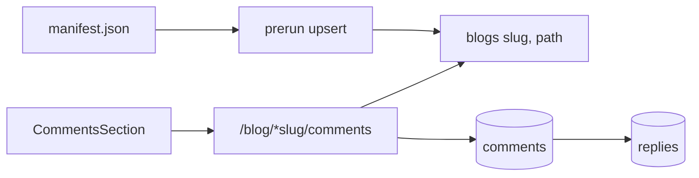

> Part 4. Previous: [the Zig API](/posts/blog/guides/scorpio/the-zig-api). Series [intro](/posts/blog/guides/intro).

Postgres is not the blog.

I keep saying that because it is the decision people trip on. The body you are reading came from a chunk file. The database has a row that says this slug exists, so a comment has something to hang from.

## Prerun

`zig build prerun` (and therefore `zig build run`) applies three SQL files, then upserts from the manifest.

```zig
const sql_files = [_][]const u8{
    "sql/001_blogs.sql",
    "sql/002_comments.sql",
    "sql/003_replies.sql",
};
// apply each file
try upsertBlogs(pool, allocator, cfg.blog.pack_dir);
```

The upsert is small on purpose:

```sql
insert into blogs (slug, path)
values ($1, $2)
on conflict (slug) do update set path = excluded.path
```

No body. No hash. No chunk pointer. If I move a file, the path updates. If I delete a post from the pack, the `blogs` row stays. There is no prune. Orphan comment threads on a removed slug are a real leftover.

The `prerun` **binary** does not pack. `zig build prerun` does, because `build.zig` wires the dependency. Docker runs `pack-blog` only when the manifest is missing (or `FORCE_PACK=1`), then `prerun`, then `scorpio`. Three different stories. I pick the wrong one at least once per deploy.

## The tables

```sql
CREATE TABLE IF NOT EXISTS blogs (
    id UUID PRIMARY KEY DEFAULT gen_random_uuid(),
    slug TEXT NOT NULL UNIQUE,
    path TEXT NOT NULL,
    created_at TIMESTAMPTZ NOT NULL DEFAULT NOW()
);
```

Comments point at `blog_id`. Replies point at `comment_id` and also copy `blog_id` so a scoped delete does not have to join.

```sql
CREATE TABLE IF NOT EXISTS comments (
    id UUID PRIMARY KEY DEFAULT gen_random_uuid(),
    blog_id UUID NOT NULL REFERENCES blogs(id) ON DELETE CASCADE,
    author TEXT NOT NULL,
    body TEXT NOT NULL,
    created_at TIMESTAMPTZ NOT NULL DEFAULT NOW(),
    updated_at TIMESTAMPTZ NOT NULL DEFAULT NOW()
);
```

Same shape for `replies`, plus `comment_id`. Cascade on blog delete, cascade on comment delete.

## The HTTP side

Every comment action starts the same way: `BlogDb.blogIdBySlug(slug)`. No row → 404, *"This post isn't set up for comments yet."* That is what you see if the API is up but prerun never ran against this manifest.

| Method | Path | Job |
| --- | --- | --- |
| GET | `/blog/*slug/comments` | comments + nested replies |
| POST | `/blog/*slug/comments` | `{ author, body }` |
| PUT | `/blog/*slug/comments/:comment_id` | `{ body }` |
| DELETE | `/blog/*slug/comments/:comment_id` | `{ deleted: true }` |
| POST | `/blog/*slug/comments/:comment_id/replies` | `{ author, body }` |
| PUT / DELETE | `…/replies/:reply_id` | update / delete |

Create and update require non-empty `author` / `body` through the validation library. Creating a reply also checks the parent comment belongs to that blog:

```sql
select 1 from comments where id = $1::uuid and blog_id = $2::uuid
```

No row, no reply. I do not want a reply attached to a comment on a different post because someone guessed UUIDs.

## What the UI actually calls

The React client lists, creates, and deletes. It does **not** wrap the PUT routes. There is no edit form. The server can update a comment. The page you are looking at cannot.

I will either add the form or stop advertising CRUD. Right now the honest list is: write a comment, write a reply, delete yours if the UI exposes delete, live with typos.



Bodies stay in the pack. Identity and conversation stay in Postgres. Mixing them would make "republish a post" mean "rewrite a row that comments depend on". This split is the whole comment design.

Next: [the React UI](/posts/blog/guides/scorpio/the-frontend).
