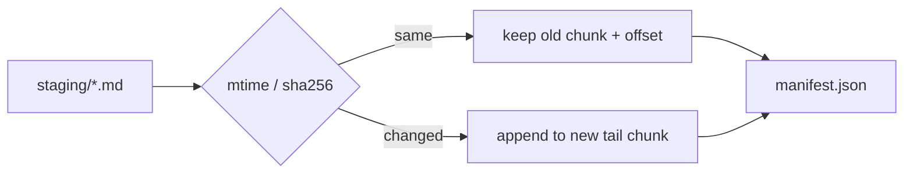

> Part 2. Previous: [packing markdown](/posts/blog/guides/scorpio/packing-markdown). Series [intro](/posts/blog/guides/intro).

I already argued that a [manifest is just a cache file](/posts/blog/projects/why-a-manifest-file). This post is the Scorpio-shaped version of that argument.

After staging, the packer has a pile of markdown files. It concatenates them into chunk files and writes one JSON index. At request time the server never opens `packing-markdown.md`. It opens `chunk_0000.dat` at an offset.

## The types

```zig
pub const ChunkEntry = struct {
    id: u32,
    file: []const u8,
    size: u64,
    sha256: []const u8,
};

pub const DocumentEntry = struct {
    slug: []const u8,
    path: []const u8,
    chunk: u32,
    offset: u64,
    length: u64,
    modified_at: i64,
    sha256: []const u8,
};

pub const Data = struct {
    version: u32 = 1,
    generated_at: i64 = 0,
    chunk_size: u64 = 0,
    chunks: []const ChunkEntry = &.{},
    documents: []const DocumentEntry = &.{},
};
```

A document is a single seek-read. `chunk`, `offset`, `length`. Plus a slug so the API can find it in O(1), a path so the sidebar can rebuild folders, an mtime, and a hash so the next pack can skip work.

Loaded, the manifest also builds `doc_by_slug`. That map is why `GET /blog/guides/intro` does not scan the array.

## Why 4 MiB and why `.dat`

```zig
max_chunk_size: usize = 4 * 1024 * 1024,
chunk_basename: []const u8 = "chunk",
packing_extension: []const u8 = ".dat",
```

4 MiB is big enough that a normal post (and a few neighbours) live in one file, small enough that a cache miss is not a disaster. Hercules uses 64 MiB because those chunks are other people's videos. These chunks are my essays.

The extension used to be `.bin`. Cloudinary rejects some raw `.bin` uploads. `.dat` gets through. The old guide still said `chunk_NNNN.bin`. The code does not.

A post larger than 4 MiB gets its own chunk (`oversize_policy = .own_chunk`). There is a `.split` enum value. It does not split. I left the name for later.

## Slugs

Default `slug_from` is `.relative_path`. Strip the extension from the path relative to the staging root.

```
pages/blog/guides/intro.md
  → staged as blog/guides/intro.md
  → slug  blog/guides/intro
```

If you forget `.env` and take `config.zig`'s default `BLOG_INPUT_DIR=pages/blog`, that same file stages as `guides/intro.md` and the slug loses the `blog/` prefix. The frontend tries both (`slugCandidates` in `api.ts`). I still set `pages` in `.env` so profile.md is in the pack.

Hidden path segments (anything starting with `.`) are skipped. Duplicate slugs fail the pack. Documents are sorted by relative path before packing, which also becomes the neighbor order for prefetch.

## Incremental pack, not a full rewrite

The interesting function is `decide`.

```zig
fn decide(self: *Packer, file: File, slug: []const u8) !Planned.Decision {
    const prev_entry = // previous manifest row for this slug
    const mtime: i64 = @intCast(file.modified_at);
    if (prev_entry) |entry| {
        if (entry.modified_at == mtime) {
            return .{ .reuse = entry.* };
        }
    }
    // read bytes, sha256
    if (prev_entry) |entry| {
        if (std.mem.eql(u8, hex, entry.sha256)) {
            return .{ .reuse = entry.* };
        }
    }
    return .{ .write = .{ .content = content, .sha256_hex = hex } };
}
```

Same mtime as last time → reuse the old chunk/offset, do not even read the file. Mtime changed but hash matches → reuse anyway (touch, copy, checkout noise). Hash changed → append the new bytes to a tail chunk.

Unchanged posts keep their old addresses. New or edited posts go into new `chunk_NNNN.dat` files. Chunk ids increment. We do not rewrite `chunk_0000.dat` because one post at the front grew.

Dead space piles up. When more than half the bytes in surviving chunks are unused (`compaction_threshold = 0.5`), or when we are migrating `.bin` → `.dat`, the packer does a compact pass from chunk 0 and deletes orphans.



## Two clocks, one file

`generated_at` is unix **seconds**. `modified_at` is filesystem mtime in **nanoseconds**. I know. I look at the JSON and blink every time. Do not compare them to each other.

`hash_algorithm` in config can say sha512 or blake3. `hashHex` always uses SHA-256. Another leftover.

## What a listing actually is

`GET /blog` does not open chunks. It walks `manifest.data.documents` and returns slug, path, mtime, length. The index page of this site is that array, paginated in the browser.

The body wait until someone asks for a slug. That is [part 3](/posts/blog/guides/scorpio/the-zig-api).

Next: [the Zig API](/posts/blog/guides/scorpio/the-zig-api).
