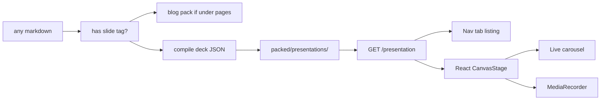

This README is both a blog post and a tagged deck. The source of truth for the renderer contract is [`libraries/processor/presentation/RENDER.md`](/posts/blog/guides/scorpio/rendering-slides). Any markdown file that contains at least one slide block compiles to `packed/presentations/<slug>.json`.

## Fetch

- `GET /presentation` → `{ documents: [{ slug, title, path, duration_ms, size }] }`
- `GET /presentation/*slug` → the deck object
- Types in `web/src/lib/presentation.ts` mirror `deck.zig`
- Listing: `/presentations`. Player: `/presentations/<slug>`

Unknown node kinds, channels, and fields must be skipped. If `version` is newer than the client, refuse to play.

## Coordinate system

Origin is top-left. `+x` right, `+y` down. Units are CSS pixels at authored `size` (default `1920x1080`). Letterbox in the viewport; record the unletterboxed canvas. Transform origin is the node center unless `origin` is set.

## Paint loop

1. Active slide = largest `start_ms <= t_ms`. Clamp after the last slide.
2. During `transition.duration_ms` at the incoming boundary, draw both slides.
3. Fill background, sort by `z`, sample tracks, compose **scale then rotate then translate**.
4. Draw `text` / `image` / `shape` / `table` natively. Pre-rasterize `markdown` and `mermaid` to `ImageBitmap`s before play or record.

## Easing

Outgoing-keyframe ease, `x` in `0..1`:

| Name | Formula |
| --- | --- |
| `linear` | `x` |
| `ease` | `x * x * (3 - 2 * x)` |
| `ease-in` | `x * x` |
| `ease-out` | `1 - (1 - x)^2` |
| `cubic-in` | `x^3` |
| `cubic-out` | `1 - (1 - x)^3` |
| `cubic-in-out` | `x < 0.5 ? 4x^3 : 1 - (-2x+2)^3 / 2` |

Hold first / hold last. Independent channels compose.

## Clocks

Live clock is `performance.now()`. Record clock is `frameIndex * (1000 / fps)`. Space pauses live playback. Recorder auto-advances and muxes `captureStream(fps)` with soundtrack buffers.

Authoring styles in the README:

```markdown
---
background: '#0a0d14'
color: '#eef1f7'
font: 'Bricolage Grotesque, Inter, sans-serif'
---

<slide id="open" background="#111827" color="#e5e7eb" font="Inter, sans-serif">
# Hello {color="#f6c244" size="72" weight="700"}

{kind="video" id="hero"}
</slide>
```

Inline HTML in markdown nodes (`<span style="color:#f6c244">…</span>`) is snapshotted onto the canvas.

<slide id="open" duration="5s" transition="fade">
# Rendering slides from packed decks {color="#f6c244"}

Zig compiles slide tags into JSON. React paints the timeline on a canvas and can record WebM from the same clock.

<animate target="title" from="0ms" to="800ms" ease="cubic-out">
  <keyframe at="0%" translate="0,40" scale="0.9" opacity="0"/>
  <keyframe at="100%" translate="0,0" scale="1" opacity="1"/>
</animate>
</slide>

<slide id="table" duration="6s">
# Node kinds the player must paint

Tables compile to `{ headers, rows }` and draw as a grid. Mermaid fences compile to `source` and become bitmaps at load.

| Kind | Paint |
| --- | --- |
| `text` | wrapped fillText |
| `table` | header + cell grid |
| `mermaid` | SVG → ImageBitmap |
| `markdown` | offscreen snapshot |
| `image` | drawImage + fit |
</slide>

<slide id="flow" duration="6s">
# Pack to player


</slide>
