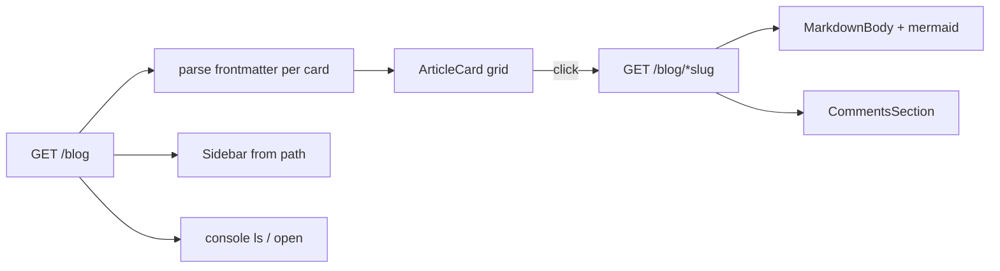

> Part 5, last one. Previous: [comments](/posts/blog/guides/scorpio/comments-and-postgres). Series [intro](/posts/blog/guides/intro).

The UI is a Vite app that pretends the Zig API is the same origin.

In dev, `vite.config.ts` proxies `/blog` and `/hello` to `http://127.0.0.1:9090`. In Docker, nginx does the same job. Relative `fetch('/blog/…')` works in both places.

```bash
cd web && npm install && npm run dev
# http://127.0.0.1:5173
```

## Two routes that matter

TanStack Router:

- `/` — the index
- `/posts/$` — everything after `/posts/` is the slug splat

`AppProvider` loads `GET /blog` once and keeps `documents` in context. Theme, locale, and the console state sit next to that list in localStorage.

## Cards are parsed posts

The index paginates the listing (`LIST_PAGE_SIZE` is 8). For each visible row it then calls `getDocument(slug)` and runs `listingToCard`.

```ts
export function listingToCard(doc: BlogListing, full: BlogDocument | null): CardData {
  const parsed = parseFrontmatter(full.content)
  return {
    slug: doc.slug,
    title: parsed.data.title?.trim() || firstHeading(parsed.content) || doc.slug,
    excerpt: /* summary, or body, clipped */,
    tags: parsed.data.topics?.map((t) => t.toUpperCase()) ?? categoriesFromPath(doc.path),
    cover: coverMedia(parsed.data.image),
  }
}
```

That is why the listing API does not send titles. Frontmatter lives inside the packed bytes. The cost is one extra GET per card. After the cache is warm it is cheap. The first visit to page 2 still feels it.

`coverMedia` accepts three shapes for `image:`:

- markdown `` — this series uses `cover41.jpeg` that way
- a bare URL
- an HTML `<video src="…" autoplay loop muted playsinline>` — the Hercules intro

`CoverMediaView` renders the video muted and looping, or an `img`. Cards lazy-load. The post page uses `eager`.

## The post page

`posts.$.tsx` loads `getDocument(params._splat)`, parses frontmatter again, rewrites a few image URL flavours (GitHub blob → raw, Hashnode `align="center"`, old Stripe paths), and hands the body to `MarkdownBody`.

```tsx
<ReactMarkdown
  remarkPlugins={[remarkGfm]}
  rehypePlugins={[rehypeRaw]}
  components={components}
>
  {content}
</ReactMarkdown>
```

`rehype-raw` is why a `<video>` in a post survives. `pre` + `language-mermaid` becomes `MermaidDiagram` instead of a code block. Headings get ids so you can link to a section. Gist `<script>` tags become iframes.

Below the body: `CommentsSection`. Sidebar on the left is `buildTree(documents)` from each `path`, so `blog/guides/scorpio/the-frontend.md` shows up under guides → scorpio.

## Slugs are messy, so the client guesses

Pack slugs look like `blog/guides/intro`. People type `/posts/guides/intro`. `slugCandidates` tries the raw splat, with a `blog/` prefix, and without it, and uses the first GET that works.

```ts
function slugCandidates(slug: string): string[] {
  const trimmed = slug.replace(/^\/+|\/+$/g, '')
  const out = [trimmed]
  if (!trimmed.startsWith(BLOG_PREFIX)) out.push(`${BLOG_PREFIX}${trimmed}`)
  if (trimmed.startsWith(BLOG_PREFIX)) {
    out.push(trimmed.slice(BLOG_PREFIX.length))
  }
  return [...new Set(out)]
}
```

Ugly. Works. A single `BLOG_INPUT_DIR` convention would make it unnecessary.

## The console

Press `c`. Or just look at the bottom. Default state is open because I like it that way.

```
ls
open blog/guides/intro
theme set paper
help
```

`open` matches slug or path from the same document list. `theme` writes the class on `<html>`. There is a `music` command I will not explain here.

## Things the UI does not do

- It does not consume the API `prefetch` array.
- It does not call PUT on comments.
- `highlight` in frontmatter is parsed and then mostly ignored. I have helper functions in `highlight.ts` that are not wired to `PostTitle`.
- Related posts in the footer pick other cards, not a real similarity rank.



## The series, one more time

1. [Packing markdown](/posts/blog/guides/scorpio/packing-markdown)
2. [The manifest and the chunks](/posts/blog/guides/scorpio/manifest-and-chunks)
3. [The Zig API](/posts/blog/guides/scorpio/the-zig-api)
4. [Comments and Postgres](/posts/blog/guides/scorpio/comments-and-postgres)
5. This post

Start at [How Scorpio works](/posts/blog/guides/intro) if you jumped in here.

I am Caleb. You can reach me on [LinkedIn](https://www.linkedin.com/in/adewole-caleb).

Peace.
