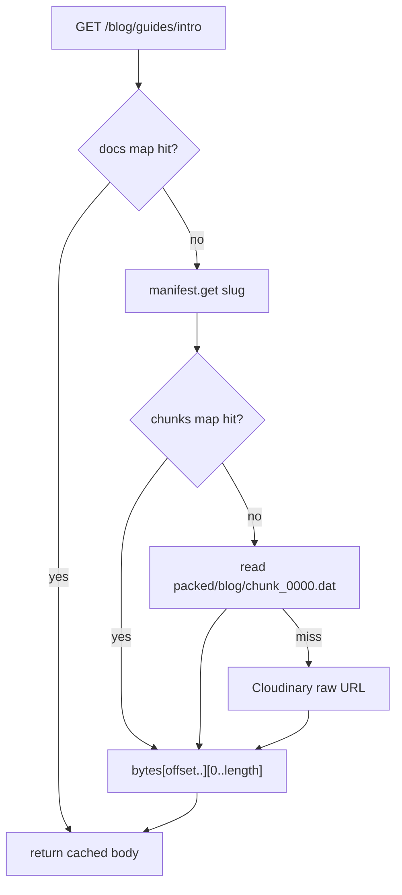

> Part 3. Previous: [the manifest](/posts/blog/guides/scorpio/manifest-and-chunks). Series [intro](/posts/blog/guides/intro).

`scorpio` is a small HTTP process. It does not pack. It does not migrate. It loads what pack and prerun already wrote, then answers requests.

`main.zig` is picky about order.

1. Parse `.env`.
2. Open a Postgres pool.
3. `Manifest.load(pack_dir, "manifest.json")` — missing file exits with "run `zig build pack`".
4. Build `BlogCache` around that manifest and a Cloudinary client.
5. Register routes.
6. Listen on `SERVER_PORT` (9090).

If the manifest is stale, the API is stale. Restart after pack. `zig build run` packs for you because the build graph says `run → prerun → pack`. A binary you already started does not notice new chunks.

## The routes that exist

Comment routes are registered **before** the document splat. Otherwise `/blog/guides/intro/comments` would be eaten by `*slug`.

```zig
try app_router.register(.GET, "/blog", actions.blogs.List);
try app_router.register(.GET, "/blog/*slug/comments", actions.comments.List);
try app_router.register(.POST, "/blog/*slug/comments", actions.comments.Create);
// PUT / DELETE comments, then replies …
try app_router.register(.GET, "/blog/*slug", actions.blogs.Get);
```

`*slug` captures one or more segments. `/blog/guides/intro` becomes `guides` + `intro` in the matcher, then `Value.toString` flattens that to `guides/intro` or `blog/guides/intro` depending on what the client sent. Trailing pieces like `/comments` are matched from the end.

`:comment_id` is a single segment, parsed as int/float/string.

Unmatched path → `{"error_message":"not found"}`.

`/hello` and `/hello/:name` are still there. I used them to debug the router. They stayed.

## Listing is free

`GET /blog` never touches a chunk.

```zig
for (app.manifest.data.documents) |doc| {
    try docs.append(exits.allocator, .{
        .slug = doc.slug,
        .path = doc.path,
        .modified_at = doc.modified_at,
        .length = doc.length,
    });
}
```

That is the whole index API. Titles and covers are not here. The UI fetches each body later and parses frontmatter. N+1. I know. The bodies are small and the cache helps after the first page.

## A post is a slice

`GET /blog/*slug` is `findDocument` then `cache.getDocument`.

```zig
const doc = app.findDocument(inputs.slug) orelse
    return exits.send(.notFound, .{ .error_message = "We couldn't find that post. …" });

const content = try app.cache.getDocument(inputs.slug);
const neighbors = try app.neighborSlugs(inputs.slug, exits.allocator);
app.cache.prefetch(neighbors);
```

The friendly description on `Get` still says "from Cloudinary". That is leftover. The cache prefers disk.



`BlogCache` is two hash maps and an `RwLock`.

- `chunks` — whole `chunk_0000.dat` bytes, keyed by filename
- `docs` — already sliced bodies, keyed by slug

First reader of a slug pays for the chunk load. Everyone else gets the slice. Prefetch warms neighbours (previous/next in manifest order, count from `BLOG_PREFETCH_NEIGHBORS`). The JSON includes a `prefetch` array. The React client **does not use it**. The warming is server-side only. Another leftover.

## Local first, CDN second

```zig
pub fn fetchChunk(self: *Cdn, file: []const u8) ![]u8 {
    const local_path = try std.fmt.allocPrint(self.allocator, "{s}/{s}", .{ self.pack_dir, file });
    if (libraries.fs.cwd().readFileAlloc(/* local */)) |bytes| {
        return bytes;
    } else |_| {}
    // public_id = pack_prefix + "/" + file
    // GET Cloudinary raw delivery
}
```

A laptop with `packed/blog/` never calls Cloudinary for bodies. A host that only has the manifest and credentials can still serve posts. That was the whole point of packing.

## Actions are small structs

I did not keep a single `blog.zig`. There is `actions/blogs/list.zig`, `get.zig`, then `comments/` and `replies/`. Each action declares `Inputs`, `Exit`, and `run`. The router binds path params and JSON bodies through the validation library.

The Get action's `description` string is wrong. The behaviour is not. Believe `cache.zig`.

Next: [comments and Postgres](/posts/blog/guides/scorpio/comments-and-postgres).
