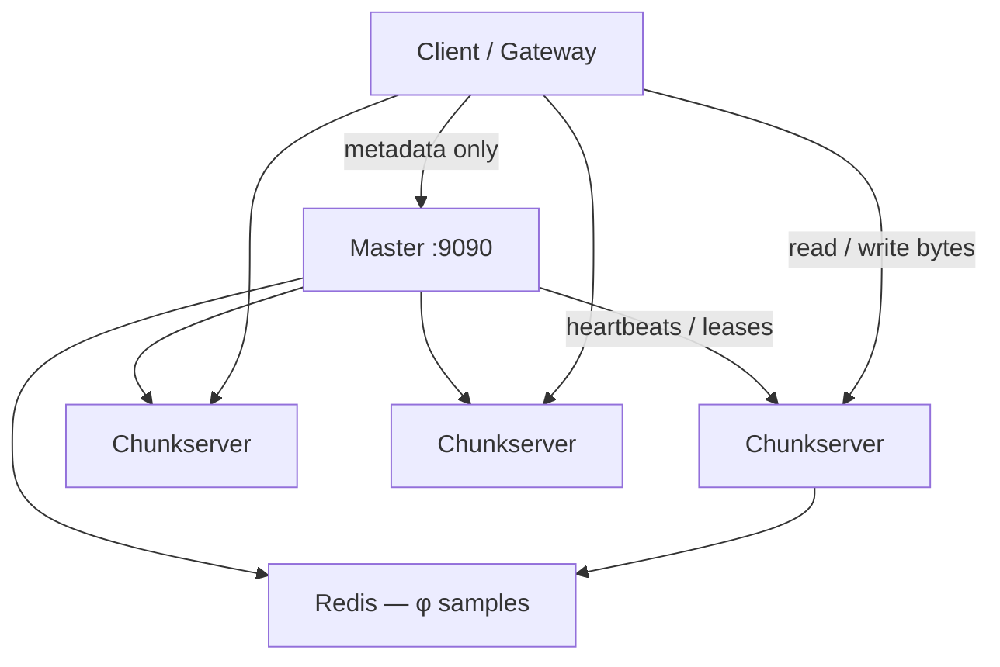

I have been meaning to write about [Hercules](https://github.com/caleberi/hercules-dfs) properly.

The repo README still has that line I left at the top on purpose: I have not run my own benchmarks yet, I am still fixing bugs and reviewing decisions, and a lot of the docs were generated with an LLM. I said I would edit them poco a poco. This series is that edit, just in blog form.

The short version. Hercules is my attempt at the [Google File System](https://research.google/pubs/pub51/) in Go. One master that only knows metadata. A bunch of chunkservers that actually hold the bytes. Files split into 64MB chunks. Writes go through a lease so one replica is in charge. Heartbeats keep the cluster honest. There is a φ Accrual detector sitting on Redis watching those heartbeats, and an HTTP gateway if you do not want to speak RPC.

It works overall. That is the honest sentence. Not "production-grade at Google scale". Not the fake 500 MB/s numbers that ended up in the README. It boots, it stores files, it replicates, and I am still poking at the decisions.

If you already read my note on [data replication and versioning](/posts/blog/hashnode/data-replication-and-versioning), this is the same idea with a full system around it.

## Why even bother

I wanted to feel the GFS paper, not just highlight it.

Reading "the master is not on the data path" is one thing. Writing the client so it asks the master for a handle, then talks to a chunkserver directly, then retries because the lease expired while you were forwarding bytes — that is a different kind of understanding.

Same for versions. Same for "what do we do when a chunkserver just disappears". Same for "is this file even a file or just a path in a tree".

Hercules is that homework. Public, messy in places, useful if you want to see how the pieces fit.

## The shape of the thing

Three rules I kept coming back to:

1. The master does not store your file. It stores the map of the file.
2. Data never has to bounce through the master. Client to chunkserver is the hot path.
3. One replica is the primary for a while (a lease). The others follow its order.

If those three make sense, the rest of the series is just details.

## What is actually in the repo

Not the LLM feature list. The packages.

| Package | What it really does |
| --- | --- |
| `master_server` | Namespace, chunk handles, leases, re-replication |
| `chunkserver` | `chunk-{handle}.chk` on disk, mutations, heartbeats |
| `namespace_manager` | In-memory directory tree, soft delete |
| `hercules` | Go client — lease cache, read/write/append |
| `gateway` | Gin HTTP API over that client |
| `download_buffer` | 10-second staging area before a write commits |
| `detector` | φ Accrual samples in Redis |
| `archive` | Gzip cold chunks. Not snapshots. The name is louder than the code. |

`main.go` is a switch on `-ServerType`. Master, chunkserver, or gateway. Same binary, different hat.

## This series

I split the walkthrough so each post can sit on one idea.

1. [Chunks and the GFS idea](/posts/blog/projects/hercules/chunks-and-architecture) — why 64MB, why a single master
2. [The master and the namespace](/posts/blog/projects/hercules/the-master) — the tree, soft delete, GOB snapshots
3. [Writes, leases, and the download buffer](/posts/blog/projects/hercules/writes-leases-and-the-buffer) — push data first, then commit
4. [The chunkserver](/posts/blog/projects/hercules/the-chunkserver) — disk layout, heartbeats, checksums, the gzip "archive"
5. [Replication and failure](/posts/blog/projects/hercules/replication-and-failure) — versions, copying chunks, φ Accrual
6. [Client, gateway, and running it](/posts/blog/projects/hercules/client-gateway-and-running) — the SDK, the real HTTP routes, docker-compose

Read them in order if you can. Skip around if you already know GFS and just want the Go bits.

## A thing I should say early

Some of the docs in the repo describe APIs that do not exist. Upload endpoints, Prometheus, WebSockets, system status. The gateway that is actually compiled is smaller than that. I will point at the real routes in part 6 instead of repeating the generated reference.

Same for the README compose snippet that talks about three chunkservers. `docker-compose.yml` starts five.

Anyway. That is the map.

Next: [chunks and the GFS idea](/posts/blog/projects/hercules/chunks-and-architecture).
