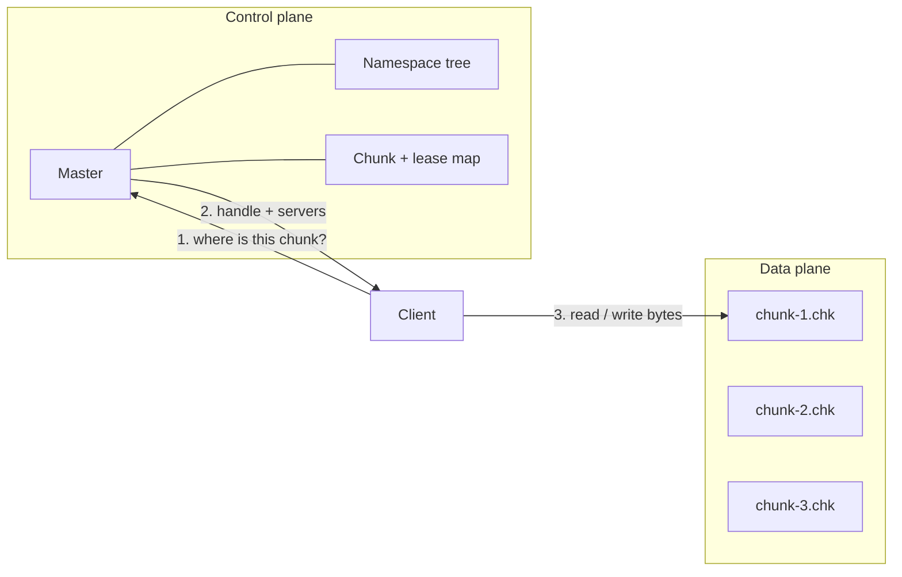

> Part 1 of the Hercules series. Start at the [intro](/posts/blog/projects/hercules-distributed-filesystem) if this is your first click.

GFS is a weird filesystem if you come from POSIX.

No "open a file and get a file descriptor that is the truth". No hard links. Appends are first-class. Small files are not the point. The paper is very clear about the workload they had at Google in 2003: huge files, sequential reads, many writers appending, machines that die often.

Hercules copies that attitude. I did not try to make `ls` and `vim` happy. I tried to make "split a big blob across machines and not lose it when one of them falls over" happy.

## A file is just a list of chunks

A Hercules file is a path plus an ordered list of chunk handles.

A chunk is a 64MB piece. The constant lives in `common/constants.go` and I left it matching the paper:

```go
const (
    ChunkMaxSizeInMb   = 64
    ChunkMaxSizeInByte = 64 << 20 // 64 MiB
    AppendMaxSizeInByte = ChunkMaxSizeInByte / 4
)
```

Why that big?

If chunks were 4KB like a disk block, the master would drown in metadata. A 1GB file would be 262,144 chunk records. At 64MB the same file is 16 records. The client can cache "handle 7 lives on these three servers" and stop bothering the master for a while.

The cost is the obvious one. A 20 byte file still occupies a chunk record. Internal fragmentation. GFS accepted that. So did I. If you are storing millions of tiny files, this is the wrong system. Use something else.

Appends are capped at a quarter of a chunk (16MB) so one append cannot blow past the end and leave a mess. If it would overflow, the primary pads the current chunk and the client retries on the next one. That dance is [part 3](/posts/blog/projects/hercules/writes-leases-and-the-buffer).

## One master, on purpose

A lot of modern stores run away from a single metadata node. GFS leaned into it.

The argument in the paper is simple enough: if the master is not on the data path, it is not the throughput bottleneck. Clients ask it "where is chunk 4 of `/logs/app.log`", get an answer, and then never talk to it again for that read.

Hercules follows that. `MasterServer` holds:

- the namespace tree
- file → chunk handle lists
- handle → replica locations
- who currently holds the write lease

It does not hold the bytes. Those sit on chunkservers as ordinary files named `chunk-{handle}.chk`.



The master can still become a pain for metadata-heavy workloads. Creating a million empty files will hurt. That is a known limit, not a surprise I discovered later.

## Handles are just numbers

I did not hash the path. I did not mint UUIDs.

When a file needs a new chunk, `ChunkServerManager.createChunk` takes the current counter, increments it, and that integer is the handle. After a restart the counter is rebuilt from whatever was persisted, so we do not reuse old numbers.

Boring. Easy to debug. You can look at a disk and see `chunk-14.chk` and know which handle it is.

## Control vs data, in one read

A read in Hercules looks like this from the client's point of view:

1. Ask the master for file info (`length`, how many chunks).
2. For each 64MB window, ask for the handle at that index.
3. Ask the master for replica addresses of that handle.
4. Pick one replica at random and call `RPCReadChunkHandler`.

Notice step 4 never goes back through the master. The bytes travel once, from disk to client.

Writes add a lease and a staging buffer. I am saving that for part 3 because it is the part people get wrong when they only read the paper once.

## What I kept from the paper, what I did not

Kept:

- 64MB chunks
- 3 replicas as the minimum (`MinimumReplicationFactor`)
- single master
- lease-based mutation
- heartbeats
- "applications can live with a relaxed consistency model"

Did not keep, or only half-kept:

- There is no write-ahead operation log on the master. Persistence is a GOB snapshot of the namespace and some chunk metadata, every 15 hours and on shutdown. Replica locations are rebuilt from chunkserver reports after a restart. That is a real difference and I am not pretending otherwise.
- Shadow masters / multi-master? Not there.
- The φ Accrual detector is extra. The paper just used missed heartbeats. I wanted to play with the 2004 Hayashibara paper, so it is in the repo. Whether it actually *decides* a node is dead is a more interesting sentence — see [part 5](/posts/blog/projects/hercules/replication-and-failure).

## The mental model I use

Think of a library.

The catalogue is the master. It tells you which shelf holds volume 4 of a title. The shelves are chunkservers. You do not carry the book through the catalogue desk. You walk to the shelf.

If a shelf collapses, the catalogue should already know there are two other copies, and it should start making a new one.

That is the whole architecture. The rest is how the catalogue stays honest when people are writing in the books.

Next: [the master and the namespace](/posts/blog/projects/hercules/the-master).
