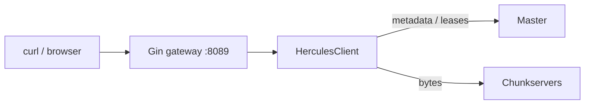

> Part 6, last one. Previous: [replication and failure](/posts/blog/projects/hercules/replication-and-failure). Series [intro](/posts/blog/projects/hercules-distributed-filesystem).

If you do not want to speak `net/rpc`, you probably never touch a chunkserver yourself. You talk to `HerculesClient`, or you talk to the gateway that wraps it.



## The client is a lease cache with manners

```go
type HerculesClient struct {
    ctx      context.Context
    cancel   context.CancelFunc
    cache    map[common.ChunkHandle]*common.Lease
    master   common.ServerAddr
    cacheMux sync.RWMutex
}
```

Construct it with the master address and a cleanup interval. A goroutine walks the cache and drops expired leases. The gateway uses 5 minutes. Left at `0` it becomes 1 minute.

Useful methods:

```go
client := hercules.NewHerculesClient(ctx, "127.0.0.1:9090", time.Minute)
defer client.Close()

_ = client.MkDir("/notes")
_ = client.CreateFile("/notes/hello.txt")
_, _ = client.Write("/notes/hello.txt", 0, []byte("hi from hercules"))
buf := make([]byte, 32)
n, _ := client.Read("/notes/hello.txt", 0, buf)
_, _ = client.Append("/notes/hello.txt", []byte(" again"))
entries, _ := client.List("/notes")
```

`Write` slices the payload into 64MB windows, asks for a handle per window, then `WriteChunk` does the lease + forward + commit dance from [part 3](/posts/blog/projects/hercules/writes-leases-and-the-buffer). Two attempts on `LeaseExpired` at the `Write` loop, three inside `WriteChunk` after evicting the cached lease.

`Read` does not use the lease cache. Replicas come from `GetReplicas`, one is chosen with `rand.Intn`. If that replica is having a bad day, the error bubbles up. Walking the rest of the list is an obvious patch I have not done.

`Append` starts at the last chunk index, and if the primary says the chunk is full, we increment and try the next handle. Max append size is 16MB.

After a write or append that grew the file, we tell the master the new length. Failure there is a warning. The bytes are already on disk.

All RPCs go through `shared.UnicastToRPCServer` with 3 retries and jittered backoff. The client is polite to transient TCP failures. It is less polite to a dead primary — that is the lease retry.

## The gateway is thinner than the docs

Gin. CORS wide open. `engine.Server` around `http.Server` for shutdown and optional TLS.

Every handler takes the lock and calls the client. There is no extra caching, no upload session, no range parser beyond query params.

The routes that exist:

| Method | Path | What it calls |
| --- | --- | --- |
| GET | `/health` | liveness |
| GET | `/api/v1/chunk/handle?path=&index=` | `GetChunkHandle` |
| GET | `/api/v1/chunk/servers?handle=` | `GetChunkServers` |
| POST | `/api/v1/mkdir` | `{ "path": "..." }` → `MkDir` |
| POST | `/api/v1/create` | `{ "path": "..." }` → parent `MkDir` + `CreateFile` |
| DELETE | `/api/v1/delete` | `{ "path": "..." }` → `RemoveDir` or `DeleteFile` |
| PATCH | `/api/v1/rename` | `{ "source", "target" }` |
| GET | `/api/v1/list?path=` | `List`, default `/` |
| GET | `/api/v1/fileinfo?path=` | `GetFile` |
| GET | `/api/v1/read?path=&offset=&length=` | `Read` as octet-stream |
| POST | `/api/v1/write?path=&offset=` | body → `Write` |
| PATCH | `/api/v1/append?path=` | body → `Append` |

Read defaults: offset 0, length 4096, max 64MB per request. Write and append slurp the whole body into memory. Do not post a 2GB file and expect streaming.

A small walk:

```bash
curl -s -X POST localhost:8089/api/v1/create \
  -H 'Content-Type: application/json' \
  -d '{"path":"/notes/hello.txt"}'

curl -s -X POST 'localhost:8089/api/v1/write?path=/notes/hello.txt&offset=0' \
  --data-binary 'hello hercules'

curl -s 'localhost:8089/api/v1/read?path=/notes/hello.txt&offset=0&length=64'
# hello hercules

curl -s 'localhost:8089/api/v1/list?path=/notes'
```

The generated `docs/api/gateway.md` talks about `/api/v1/files/upload`, `/api/v1/system/status`, metrics, websockets. Those are not in `registerRoutes`. Believe `gateway/server.go`. I will delete the fiction when I get to the docs.

## Docker Compose, as written

`docker-compose.yml` is one Dockerfile, different `SERVER_TYPE` build args.

| Service | Port | Role |
| --- | --- | --- |
| `master` | 9090 | metadata |
| `chunkserver1`–`5` | 8081–8085 | data |
| `redis` | 6379 | φ samples |
| `gateway` | 8089 | HTTP |

Five chunkservers, not three. Gateway waits until master and all five are healthy. Chunkservers need `NET_RAW` because of the proximity ping. Redis must be up before the master, because the detector wants it at boot.

```bash
git clone https://github.com/caleberi/hercules-dfs.git
cd hercules-dfs
docker compose up --build
```

Without Docker, same binary three ways:

```bash
# terminal 1
go run main.go -ServerType master_server \
  -serverAddr 127.0.0.1:9090 \
  -redisAddr 127.0.0.1:6379 \
  -rootDir ./data/master

# terminals 2–4
go run main.go -ServerType chunk_server \
  -serverAddr 127.0.0.1:8081 \
  -masterAddr 127.0.0.1:9090 \
  -redisAddr 127.0.0.1:6379 \
  -rootDir ./data/chunk1

# terminal 5
go run main.go -ServerType gateway_server \
  -gatewayAddr 8089 \
  -masterAddr 127.0.0.1:9090
```

Redis is not optional if you take the default constructors. Both master and chunkserver create a `FailureDetector` against it.

## Tests

```bash
go test ./...
```

There is also `python dtest.py` for a heavier integration pass. I use the Go tests more. I have not published a benchmark suite I trust, so I will not paste invented throughput numbers here.

## What I would change next

In no particular order, and this is me talking to future me:

1. A real operation log on the master. 15 hour GOB snapshots are not a recovery story.
2. Wire φ into failover or stop pretending it is the failure detector. Right now the 60 second timeout is the detector.
3. Verify checksums on read. We already pay for SHA-256 on persist.
4. Walk replica lists on read instead of one random pick.
5. Make append check the lease, same as write.
6. Finish heartbeat lease extension or delete the dead code path.
7. Align the suspicion thresholds and the Redis sample TTL.
8. Rewrite the docs so they match `registerRoutes`.
9. Multi-master is a fantasy until (1) exists.

None of that is hidden. The repo works well enough to study. That was the point.

## The series, one more time

1. [Chunks and the GFS idea](/posts/blog/projects/hercules/chunks-and-architecture)
2. [The master and the namespace](/posts/blog/projects/hercules/the-master)
3. [Writes, leases, and the download buffer](/posts/blog/projects/hercules/writes-leases-and-the-buffer)
4. [The chunkserver](/posts/blog/projects/hercules/the-chunkserver)
5. [Replication and failure](/posts/blog/projects/hercules/replication-and-failure)
6. This post

Code is at [github.com/caleberi/hercules-dfs](https://github.com/caleberi/hercules-dfs). The paper is still worth reading first if you have not.

I am Caleb. You can reach me on [LinkedIn](https://www.linkedin.com/in/adewole-caleb).

Peace.
