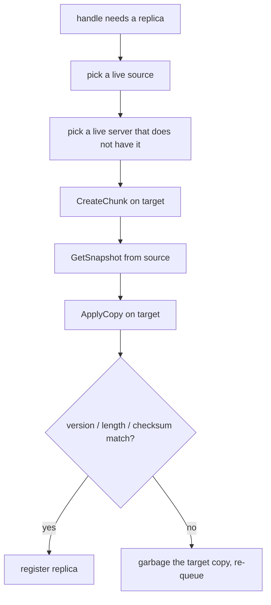

> Part 5. Previous: [the chunkserver](/posts/blog/projects/hercules/the-chunkserver). Series [intro](/posts/blog/projects/hercules-distributed-filesystem).

I already wrote about replication in the abstract [here](/posts/blog/hashnode/data-replication-and-versioning). This post is that idea bolted to Hercules.

Durability, for us, is "there are at least three copies and we can tell which ones are old". That second half is the version number.

## Versions

```go
type ChunkVersion int64
```

Monotonic. Bumped when mutations land, not when a lease is renewed. If a chunkserver was offline while the others took writes, it comes back with version 4 and the world is on version 7.

The master finds that out in two ways:

1. On lease grant, `getLeaseHolder` asks every location `CheckChunkVersion`.
2. On heartbeat, the chunkserver's `SysReport` includes versions. Mismatches get a second check against the primary.

Stale handles go on the server's garbage list. Next heartbeat reply tells that chunkserver to delete the file. We do not try to "merge" a stale replica. We throw it away and, if the live count is low, copy from a good one.

Think of the master as a teacher checking homework versions. Old assignment? Bin it. Get a fresh copy from someone who stayed in class.

## When do we copy?

`replicaMigration` is a queue of handles. Things that append to it:

- a chunkserver is declared dead and a handle now has fewer than 3 locations
- `createChunk` only succeeded on some of the targets
- lease renewal sees fewer than 3 non-stale replicas
- a previous `performReplication` failed

`serverHeartBeat` (every 10s) drains the queue and calls `performReplication`.



Source is the first live replica. Target is the first live server not already in the set. After the copy we ask both sides for a sys report and compare. Fail → mark garbage on the target, queue again.

Removing a dead server also sets `chk.expire = time.Now()` so any lease that server held is instantly invalid. Clients will bounce on `LeaseExpired` and ask for a new primary. That is the intended pain.

## What "dead" means

Two opinions live in the process. Only one of them acts.

**Opinion A — timeout.** `detectDeadServer` looks at `lastHeartBeat`. Zero or older than 60 seconds → remove, drop chunks, maybe re-replicate. This is the opinion that matters.

**Opinion B — φ Accrual.** Every 10 seconds the master calls `detector.Predict()` and logs whatever suspicion comes back. It does not call `removeServer`.

I put φ in because the binary "missed 3 heartbeats = dead" model is clumsy on a jittery network. The [Hayashibara et al. 2004](https://ieeexplore.ieee.org/document/1353004) detector gives you a suspicion score that grows as a heartbeat gets later than usual, instead of a single cliff.

The math in the code:

```go
func phi(timeDiff, mean, stdDeviation float64) float64 {
    if stdDeviation == 0 {
        return math.Inf(1)
    }
    z := (timeDiff - mean) / stdDeviation
    cdf := 0.5 * (1 + math.Erf(z/math.Sqrt2))
    if cdf >= 1.0 {
        return math.Inf(1)
    }
    return -math.Log10(1.0 - cdf)
}
```

Take the history of inter-arrival times, assume they are roughly normal, ask "how surprising is it that we have waited this long?". φ is `-log10` of the survival probability. φ = 1 → about 10% chance this silence is normal. φ = 2 → 1%. φ = 3 → 0.1%. You pick a threshold and get angry at that point.

Samples live in Redis as a sorted set, capped by window size, trimmed by a Lua script. The master constructs the detector with window 100.

## The awkward bits I should not hide

`Predict` uses the gaps between `Entry.Eta` timestamps (when we recorded the sample). `Track` also stores `Duration` (the measured RTT). The RTT is not what φ looks at. Inter-arrival of samples is. If the ticker is regular, the distribution is the ticker plus delay, not the ping time. Fine if you treat it as "heartbeat cadence". Confusing if you think we are scoring latency.

Thresholds are also a bit messy. Comments talk about alert at 8 and warning at 1. `main.go` starts the master with `AccumulationThreshold: 3.0` and `UpperBoundThreshold: 8.0`. `Interpret` alerts when φ ≥ accumulation, warns when φ ≥ upper bound. With 3 and 8, alert fires first. Chunkservers use `{7, 3}`, which matches the comment. I have not unified this. Logging-only, so it has not bitten a failover. It would if we ever wired φ into `removeServer`.

Master entry expiry for Redis samples is `10 * time.Millisecond` in `main.go`. That is aggressive. Combined with a 10 second predict interval, you can easily land on `ErrNotEnoughHistoricalSamples`. The chunkserver path swallows that error. The idea is right. The constants need a second pass.

## Failure, from a client's point of view

You do not see φ. You see errors.

- `LeaseExpired` — primary changed or timed out. Retry, cache dropped.
- `DownloadBufferMiss` — you were too slow, push again.
- `WriteExceedChunkSize` / `AppendExceedChunkSize` — move to the next chunk.
- A down replica on read — we picked at random and did not walk the list. A retry of the whole `Read` will ask the master again and might land elsewhere. Replica failover on read is thinner than I want.

RPC itself retries: `shared.DefaultRetryConfig` is 3 attempts, 500ms exponential backoff, jitter. That covers blips, not "the primary is gone".

## Why versions plus copies is enough (most of the time)

You do not need a consensus protocol to store a blob if you are willing to say:

- one primary at a time for writes (lease)
- secondaries apply the same mutation in the same order
- a replica that missed that history is trash
- the master will grow a new replica from a good copy

That is GFS. Hercules is that story with a snapshot copy and a φ score in the logs.

Would I trust it with the only copy of something I care about? Not yet. Three replicas and a 15 hour metadata snapshot is a study setup. It is a good setup to learn from.

Next: [the client, the gateway, and how to actually run this](/posts/blog/projects/hercules/client-gateway-and-running).
