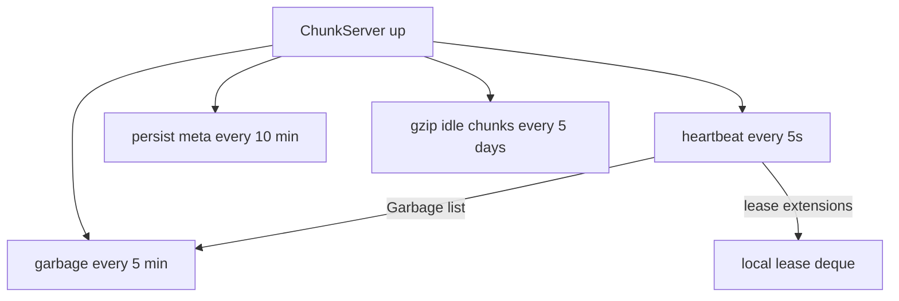

> Part 4. Previous: [writes and leases](/posts/blog/projects/hercules/writes-leases-and-the-buffer). Series [intro](/posts/blog/projects/hercules-distributed-filesystem).

If the master is a catalogue, a chunkserver is a room full of boxes.

Each box is a file:

```
chunk-14.chk
```

That is it. `common.ChunkFileNameFormat` is `"chunk-%v.chk"`. No directory sharding, no custom block device. The `file_system` package sandboxes everything under the process root so a handle cannot escape to `../../etc/passwd`. Boring on purpose. I wanted to debug with `ls`.

## What the process holds

```go
type ChunkServer struct {
    listener        net.Listener
    rootDir         *filesystem.FileSystem
    archiver        *archivemanager.ArchiverManager
    downloadBuffer  *downloadbuffer.DownloadBuffer
    failureDetector *detector.FailureDetector
    chunks          map[common.ChunkHandle]*chunkInfo
    leases          common.Deque[*common.Lease]
    garbage         common.Deque[common.ChunkHandle]
    ServerAddr      common.ServerAddr
    MasterAddr      common.ServerAddr
    // ...
}
```

In-memory `chunks` is the index. Each `chunkInfo` has length, version, checksum, pending mutations, timestamps, and flags like `completed`, `abandoned`, `isCompressed`.

On disk there is also `chunk.server.meta` — a GOB dump of that map, written every 10 minutes and on shutdown. Corrupt meta gets renamed `chunk.server.meta.corrupt.<unix>` and we start clean, then wait for the master to tell us what to keep.

## The background loop

One goroutine, several tickers. Same process, different chores.



| Every | What |
| --- | --- |
| 5s | heartbeat to the master |
| 10 min | persist `chunk.server.meta` |
| 5 min | garbage collection |
| 5 days | archive idle chunks |

Startup also fires one heartbeat immediately so the master sees the node before the first tick.

## Heartbeats

```go
func (cs *ChunkServer) heartBeat() error {
    arg := rpc_struct.HeartBeatArgs{
        Address:     cs.ServerAddr,
        MachineInfo: cs.MachineInfo,
    }
    if cs.leases.Length() != 0 {
        arg.ExtendLease = true
    }
    return shared.UnicastToRPCServer(string(cs.MasterAddr),
        rpc_struct.MRPCHeartBeatHandler, arg, &reply, shared.DefaultRetryConfig)
}
```

The reply can contain two lists that matter:

- `LeaseExtensions` — master saying "yes, keep writing"
- `Garbage` — handles the master wants deleted

Garbage handles get pushed into `cs.garbage`. Five minutes later `garbageCollection` deletes the `.chk` (or `.chk.gz`) and drops the map entry.

There is a second heartbeat direction. The master also probes chunkservers every 10 seconds with `CRPCHeartBeatHandler` to measure RTT for the detector. So we have push and pull. A bit redundant. The push is how you register and receive garbage. The pull is how the master fills φ samples.

`ExtendLease` is a flag, not a list of handles. I will be honest: the master's handler iterates `reply.LeaseExtensions` which is empty on the way in. Lease extension via heartbeat is half-wired. The path that actually grants leases is still `getLeaseHolder` when a client asks to write. If you are reading the heartbeat code wondering where the pending leases go — that is why.

## Checksums

SHA-256 over the whole file, not the paper's 64KB blocks with 32-bit CRCs.

I mark `checksumDirty` on every `writeChunk`. The hash is recomputed when we persist metadata, when we answer `RPCSysReportHandler`, or when we snapshot a chunk for re-replication. Reads do **not** verify the checksum today. That is a gap. A silent bit flip would be served to the client. The master uses checksums when it compares replicas after a copy, so they are not decoration, they are just not on the read path yet.

```go
hasher := sha256.New()
if _, cerr := io.Copy(hasher, f); cerr == nil {
    ch.checksum = common.Checksum(hasher.Sum(nil))
    ch.checksumDirty = false
}
```

## Reads are the simple path

Client asks master for replicas, picks one at random, calls `RPCReadChunkHandler`. We `ReadAt` from the `.chk` file, update `accessTime`, and return `ReadEOF` if we came up short.

Random replica, not "closest". The `MachineInfo.RoundTripProximityTime` is used when the master *places* new chunks, not when the client *reads*. Another small inconsistency. Closest-read is the obvious upgrade.

## The "archive manager"

The README says snapshots. The code says gzip.

`ArchiverManager` is a worker pool. Half the workers compress, half decompress. `SubmitCompress("/path/to/chunk-14.chk")` writes `chunk-14.chk.gz` and deletes the original.

Every 5 days, `archiveChunks` selects handles whose `accessTime` is older than 5 days and submits them. On success, `isCompressed = true`.

A later read or write calls `unarchiveChunks` first. Concurrent decompresses share a pending result so two readers do not gunzip the same file twice.

That is a local disk optimisation. It is not a point-in-time snapshot of the filesystem. It is not cold storage on another cluster. I named the package too early and the LLM docs ran with it. The honest sentence is: idle chunks get gzipped so they take less room on the chunkserver disk.

## Creating a chunk

`RPCCreateChunkHandler` just opens an empty file. Version starts at whatever the master said. No preallocation of 64MB. The file grows as writes land. `completed` flips when length reaches `ChunkMaxSizeInByte`.

## Copying a chunk

When the master wants a new replica it does not replay mutations. It asks a live source for a snapshot.

1. `RPCGetSnapshotHandler` on the source — read the whole chunk, refresh checksum, send bytes
2. `RPCApplyCopyHandler` on the target — `writeChunk` at offset 0, set the version from the args

That is re-replication. Mutation pipelines are for live writes. Snapshots are for "this server was empty and now it should look like that one".

## RPCs on the chunkserver

| Handler | Job |
| --- | --- |
| `RPCReadChunkHandler` | `ReadAt` |
| `RPCForwardDataHandler` | stage bytes, chain to next replica |
| `RPCWriteChunkHandler` | commit a write (lease required) |
| `RPCAppendChunkHandler` | commit an append (lease not checked) |
| `RPCApplyMutationHandler` | secondary applying the same buffer id |
| `RPCCreateChunkHandler` | touch empty `.chk` |
| `RPCGrantLeaseHandler` | remember we are primary |
| `RPCGetSnapshotHandler` / `RPCApplyCopyHandler` | full-chunk copy |
| `RPCCheckChunkVersionHandler` | stale or not |
| `RPCSysReportHandler` | inventory + checksums for the master |
| `RPCHeartBeatHandler` | master-initiated probe |

If you boot a chunkserver by hand it looks like this:

```bash
go run main.go -ServerType chunk_server \
  -serverAddr 127.0.0.1:8081 \
  -masterAddr 127.0.0.1:9090 \
  -redisAddr 127.0.0.1:6379 \
  -rootDir ./data/chunk1
```

Three of those, different ports and roots, and you have a tiny cluster. The master will not consider you "live" until a heartbeat lands, so start the master first.

Next: [replication and failure](/posts/blog/projects/hercules/replication-and-failure) — what happens when one of these rooms catches fire.
