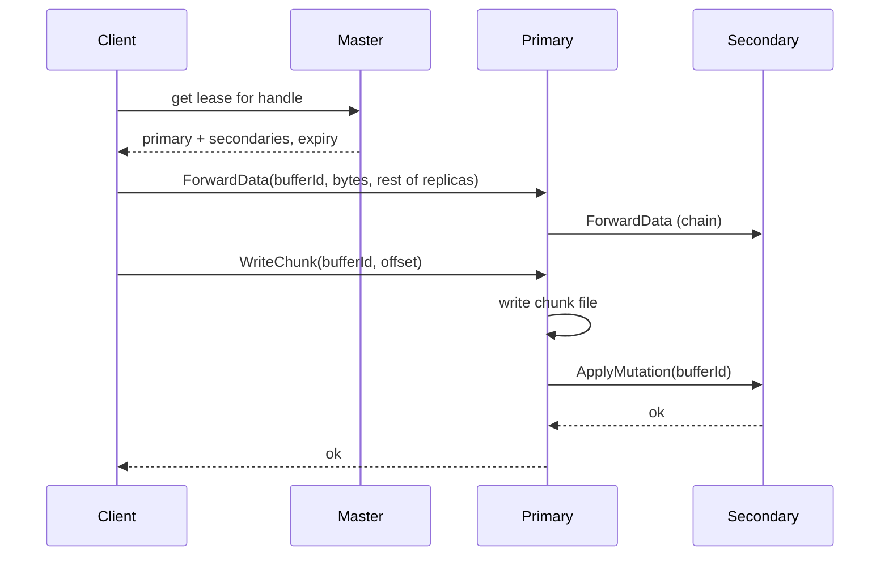

> Part 3. Previous: [the master](/posts/blog/projects/hercules/the-master). Series [intro](/posts/blog/projects/hercules-distributed-filesystem).

This is the part of GFS I had to draw on paper a few times.

A naive write is: client sends the payload to the primary, primary writes it, primary forwards the same payload to the secondaries. The bytes cross the network once per replica, in series, after the primary is already busy.

GFS splits that into two phases.

1. **Push the data** to every replica's memory. Nobody writes the chunk file yet.
2. **Send a tiny commit** to the primary. The primary picks an order, applies it, tells the secondaries "apply that buffer id".

The payload travels along a pipeline. The commit is small. If something fails you retry the commit without necessarily re-uploading 20MB.

Hercules does the same thing with a `DownloadBuffer` on each chunkserver.

## The buffer is just a map with a timer

```go
type BufferId struct {
    Handle    ChunkHandle
    Timestamp int64 // unix nanoseconds when the client minted it
}

type BufferedItem struct {
    data   []byte
    expire time.Time
}
```

`Set` stores the bytes. `Get` returns them and **slides the expiry**. Default TTL is 10 seconds. A background tick deletes leftovers.

If the commit arrives late, you get `DownloadBufferMiss`. The client treats that as "try again". I have been bitten by this during debugging when I stepped through writes too slowly. Ten seconds is short on purpose. You do not want orphaned 64MB blobs sitting in RAM.

## A write, step by step

From `HerculesClient.WriteChunk`:



`ObtainLease` hits the client's lease cache first. Miss or expired → `RPCGetPrimaryAndSecondaryServersInfoHandler` on the master. That path is `getLeaseHolder` on `ChunkServerManager`.

If the current lease is still valid, you get the same primary. If it expired, the master asks every replica `CheckChunkVersion`, drops stale ones, and picks `locations[0]` as the new primary. Then it **asynchronously** RPCs `GrantLease` to that server. The client already has the answer. The primary finds out slightly later. That race is real. Writes that land before the grant get `LeaseExpired` and retry.

Lease length is 120 seconds (`LeaseTimeout`). Some comments and older docs say 60. The constant is 120.

One thing I want to be explicit about: **lease expiry does not bump the chunk version**. Versions track mutations. A comment in `getLeaseHolder` says so because I kept wanting to bump it and then remembering why that is wrong.

## Forwarding is a chain, not a broadcast

`RPCForwardDataHandler` stores locally, then calls the same handler on `Replicas[0]` with the tail of the list. Each node sees a shorter list.

```
client → cs1 → cs2 → cs3
```

Same `BufferId` everywhere. That id is what the commit refers to. Secondaries do not receive the payload again during `ApplyMutation`. They pull it out of their own buffer.

If any hop is down, the push fails and the client retries the whole write. There is no fancy tree broadcast.

## The primary actually writing

```go
func (cs *ChunkServer) RPCWriteChunkHandler(args rpc_struct.WriteChunkArgs, reply *rpc_struct.WriteChunkReply) error {
    data, exists := cs.downloadBuffer.Get(args.DownloadBufferId)
    if !exists {
        reply.ErrorCode = common.DownloadBufferMiss
        return fmt.Errorf("could not locate %v in buffer (might have expired ...)", args.DownloadBufferId)
    }

    dataSize := common.BToMb(uint64(args.Offset) + uint64(len(data)))
    if dataSize > common.ChunkMaxSizeInMb {
        reply.ErrorCode = common.WriteExceedChunkSize
        return nil
    }
    // pick a matching lease from the local deque, reject if expired
    n, err := performWrite(cs, selected.Expire, args, data)
    // ...
}
```

`performWrite` does the local `doMutate(MutationWrite)` and fans out `ApplyMutation` to the secondaries, bounded by the lease deadline. `writeChunk` uses `WriteAt` and `Sync`. When length hits 64MB the chunk is marked `completed`.

If the lease is missing or expired, we do not write. That is the whole point of the primary. Someone has to pick a serial order. If two clients could both think they are primary, you get diverging replicas. The lease is that someone.

## Append is a slightly different animal

`Append` is the GFS record-append idea. The client does not choose the offset. The primary does.

```go
offset := chInfo.length
newLength := chInfo.length + common.Offset(len(data))
if dataSize > common.ChunkMaxSizeInMb {
    mutationType = common.MutationPad
    chInfo.length = common.ChunkMaxSizeInByte
    reply.ErrorCode = common.AppendExceedChunkSize
} else {
    mutationType = common.MutationAppend
}
```

If the data does not fit, we pad. In Hercules, pad is almost comically small: `doMutate` replaces the payload with a single zero byte and writes that. The chunk is then full. The client sees `AppendExceedChunkSize`, increments the chunk index, and retries on a new handle.

The paper pads the rest of the chunk. I pad a marker and jump. Same client-visible outcome: "this chunk is done, try the next one". Different disk contents. Worth knowing if you ever hexdump a `.chk` file.

Also: **the append handler does not check the local lease**. The client still obtains one so it knows who the primary is, but the chunkserver append path trusts that. Writes check the lease. Appends currently do not. I am not proud of the inconsistency. It is one of the decisions I am still reviewing.

Another asymmetry: `WriteChunk` forwards data to every replica. `AppendChunk` forwards to the primary and puts secondaries in the args for the chain. Same idea, slightly different call shape. Read the two functions next to each other if you are following the code.

## What "success" means

GFS is honest about consistency. A successful serial write is defined. Concurrent writes can be consistent but undefined — everyone sees the same bytes, just not a clean concatenation of whole writes. A failed write can leave replicas disagreeing until re-replication or a retry.

Hercules inherits that. There is no POSIX `write()` guarantee. If you need a transaction, this is not your store.

The client retries a couple of times on `LeaseExpired`. After a successful write that grew the file, it calls `RPCUpdateFileMetadataHandler` so the master's namespace length catches up. If that RPC fails, the write still returns success and we log a warning. Best-effort metadata. Another thing I side-eye.

## Why I like this protocol anyway

It makes the network do the expensive work first, while everyone is just stuffing a map. The primary's job is order, not bandwidth.

Once you see the buffer id as a ticket — "the data is already at every seat, now play the same instruction" — the rest of the chunkserver code reads easier.

Next: [the chunkserver](/posts/blog/projects/hercules/the-chunkserver), which is where those tickets become files on disk.
